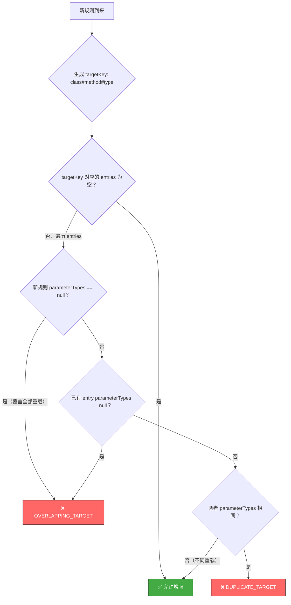
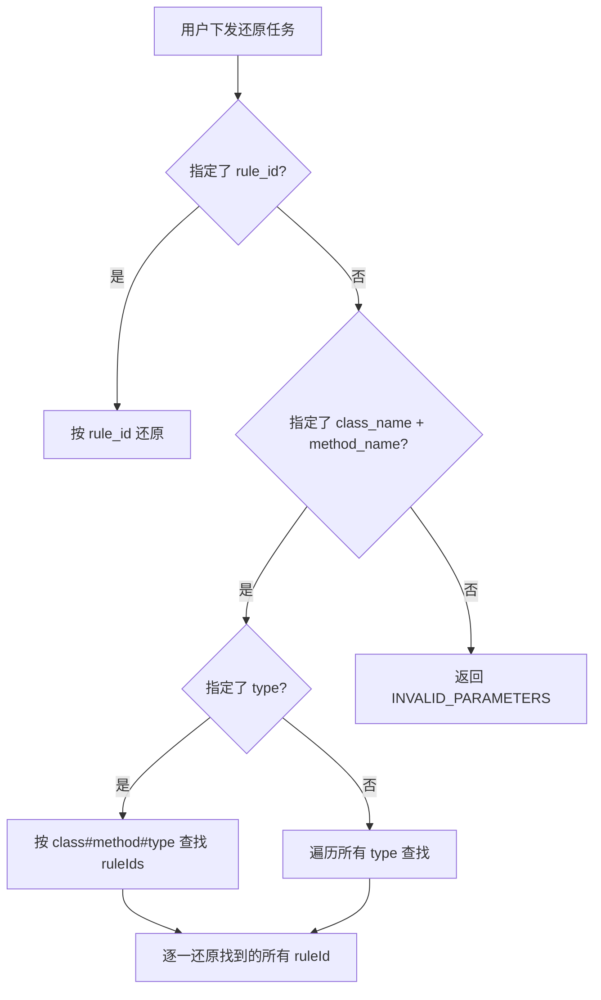

# 动态增强（Dynamic Instrumentation）改进记录

> **文档目的**：归档所有关于动态增强模块的设计讨论和代码改进  
> **时间范围**：2026-03 迭代周期

---

## 一、改进总览

| # | 改进项 | 涉及文件 | 状态 |
|---|--------|---------|------|
| 1 | [精细化冲突检测 + type 维度支持](#1-精细化冲突检测--type-维度支持) | `TransformerManager.java` | ✅ 已实施 |
| 2 | [自动推导 rule_id](#2-自动推导-rule_id) | `InstrumentationRule.java`, `DynamicInstrumentExecutor.java`, `DynamicUninstrumentExecutor.java`, `TransformerManager.java` | ✅ 已实施 |
| 3 | [JSON 构建安全化](#3-json-构建安全化) | `DynamicInstrumentExecutor.java`, `DynamicUninstrumentExecutor.java` | ✅ 已实施 |

---

## 1. 精细化冲突检测 + type 维度支持

### 1.1 问题背景

原有的 `DUPLICATE_TARGET` 检测使用 `className#methodName` 作为 key（`buildTargetKey`），存在两个问题：

1. **不含 type 维度**：对同一方法，增强了 trace 后无法再增强 metric，但从技术和语义角度来看，不同 type 的增强是完全独立的（trace 创建 Span、metric 记录指标、log 记录日志，互不干扰）
2. **不含重载方法区分**：对同一方法名的不同重载（如 `setIfAbsent(K, V)` 和 `setIfAbsent(K, V, long, TimeUnit)`），无法独立增强

同时，如果放开限制但不做精细检测，可能导致同一方法被双重增强（如先精确增强一个重载，再不指定 `parameter_types` 增强全部重载，导致前者被增强两次）。

### 1.2 技术分析

通过深入分析 ByteBuddy + JVM retransform 机制：

- 每次 `retransformClasses()` 时，JVM 会重新应用**所有**已注册的 Transformer
- 如果两个 Transformer 匹配同一个方法，该方法会被织入**两套** Advice 代码
- 对于 trace 类型，这意味着同一方法调用产生 2 个嵌套 Span
- 对于 metric 类型，同一方法调用被计数 2 次

而不同 type 的 Advice（`DynamicTraceAdvice`、`DynamicMetricAdvice`、`DynamicLogAdvice`）各自维护独立的注册表（`ConcurrentHashMap<String, ...>`），通过各自的 ruleId 查找配置，**天然不会互相干扰**。

### 1.3 方案设计

#### 数据结构升级

```java
// 旧：
ConcurrentHashMap<String, String> targetMethodToRuleId
    // key: className#methodName → value: ruleId

// 新：
ConcurrentHashMap<String, List<TargetEntry>> targetMethodToRules
    // key: className#methodName#type → value: [TargetEntry(ruleId, parameterTypes)]
```

#### 新增 `TargetEntry` 内部类

```java
private static final class TargetEntry {
    final String ruleId;
    @Nullable final List<String> parameterTypes;  // null 表示全部重载
}
```

#### 新增 `checkTargetConflict` 精细化冲突检测



### 1.4 行为变化

| 场景 | 旧行为 | 新行为 |
|------|--------|--------|
| trace `login` → metric `login` | ❌ DUPLICATE_TARGET | ✅ **允许** |
| trace `setIfAbsent(A)` → trace `setIfAbsent(B)` | ❌ DUPLICATE_TARGET | ✅ **允许**（不同重载） |
| trace `setIfAbsent(A)` → trace `setIfAbsent`（全部） | ❌ DUPLICATE_TARGET | ❌ **OVERLAPPING_TARGET**（更精确的错误码） |
| trace `setIfAbsent`（全部） → metric `setIfAbsent` | ❌ DUPLICATE_TARGET | ✅ **允许**（不同 type） |
| trace `login` → trace `login` | ❌ DUPLICATE_TARGET | ❌ DUPLICATE_TARGET（不变） |

### 1.5 改动的文件

- **`TransformerManager.java`**：
  - `targetMethodToRuleId` → `targetMethodToRules`
  - `buildTargetKey(className, methodName)` → `buildTargetKey(className, methodName, type)`
  - 新增 `TargetEntry` 内部类
  - 新增 `checkTargetConflict()` 方法
  - 新增 `formatEntryParams()` 辅助方法
  - 新增 `removeTargetEntry()` 方法（还原时精确移除对应条目）

---

## 2. 自动推导 rule_id

### 2.1 问题背景

原有协议要求用户手动指定 `rule_id`，但增强方法的唯一标识实际上是 `className + methodName + type + parameterTypes`，用户不应该需要额外构造一个 ID。

旧的 fallback 逻辑 `rule_id = context.getTaskId()` 存在问题：
- `task_id` 通常是服务端生成的 UUID（不可读、不确定性）
- 还原时用户还得记住那个 task_id
- 不同批次下发同样的增强，task_id 不同 → ruleId 不同 → 无法幂等

### 2.2 方案设计

#### 自动生成规则

```
rule_id = <SimpleClassName>.<methodName>[(<parameterTypes>)]_<type>
```

| 输入 | 自动生成的 rule_id |
|------|-------------------|
| `class=...UserService, method=login, type=trace` | `UserService.login_trace` |
| `class=...UserService, method=count, type=trace, params=""` | `UserService.count()_trace` |
| `class=...UserService, method=count, type=trace, params="Wrapper"` | `UserService.count(Wrapper)_trace` |
| `class=...UserService, method=count, type=metric` | `UserService.count_metric` |

#### 核心特性

- **确定性**：同样的输入产生同样的 ruleId → 幂等
- **向后兼容**：用户传了 `rule_id` 就用用户的，不传才自动生成
- **可读性**：从 ruleId 就能看出增强的目标方法和类型

#### 还原任务简化

新增按目标方法还原方式（不需要知道 rule_id）：



### 2.3 协议变更

**增强任务**（`rule_id` 从 ✅必填 改为 ❌可选）：

```json
{
  "task_type_name": "dynamic_instrument",
  "parameters_json": "{\"class_name\":\"com.example.UserService\",\"method_name\":\"login\",\"type\":\"trace\"}"
}
```
→ 自动生成 `rule_id = "UserService.login_trace"`

**还原任务**（新增方式 2）：

```json
// 方式 1（原有）：按 rule_id
{"rule_id": "UserService.login_trace"}

// 方式 2（新增）：按目标方法
{"class_name": "com.example.UserService", "method_name": "login", "type": "trace"}

// 方式 2 不指定 type（还原所有类型）
{"class_name": "com.example.UserService", "method_name": "login"}
```

### 2.4 改动的文件

- **`InstrumentationRule.java`**：新增 `generateRuleId()` 静态方法
- **`DynamicInstrumentExecutor.java`**：`parseRuleFromContext()` 中 `rule_id` 改为可选，不传时自动生成
- **`DynamicUninstrumentExecutor.java`**：
  - 新增 `resolveRuleIds()` 方法，支持两种解析方式
  - `execute()` 重构为支持批量还原（按目标方法可能匹配到多条规则）
- **`TransformerManager.java`**：新增 `findRuleIdsByTarget()` 公开方法

---

## 3. JSON 构建安全化

### 3.1 问题背景

代码中存在 5 处手动拼接 JSON 字符串的代码，存在以下风险：

1. **注入风险**：如果 `lastError` 包含 `"` 或 `\`，拼接出来的 JSON 非法
2. **可读性差**：转义引号 `\"` 充斥代码
3. **维护成本高**：新增字段需手动拼接，易遗漏逗号/引号

### 3.2 方案

项目中已有 `JsonUtils` 工具类（基于 Jackson），提供了两种构建方式：

- `JsonUtils.toJsonObject(key1, val1, key2, val2, ...)` — 简单 KV 场景
- `JsonUtils.objectBuilder().put(key, val).putIfNotNull(key, val).build()` — 复杂/条件化场景

### 3.3 改动详情

| 位置 | 改前 | 改后 |
|------|------|------|
| `DynamicInstrumentExecutor` 增强成功 | 手动拼接 5 个字段 | `JsonUtils.toJsonObject(...)` |
| `DynamicUninstrumentExecutor` 全部成功 | `toJsonArray()` + 拼接 | `JsonUtils.toJsonObject(...)` |
| `DynamicUninstrumentExecutor` 部分成功 | `toJsonArray()` + 拼接 + 注入风险 | `JsonUtils.objectBuilder()` + `putIfNotNull()` |
| `toJsonArray()` 方法 | 自定义实现 | **已删除**（不再需要） |

### 3.4 改动的文件

- **`DynamicInstrumentExecutor.java`**：添加 `import JsonUtils`，手动拼接改为 `JsonUtils.toJsonObject()`
- **`DynamicUninstrumentExecutor.java`**：添加 `import JsonUtils`，手动拼接改为 `JsonUtils.toJsonObject()` / `objectBuilder()`，删除 `toJsonArray()` 方法

---

## 附录：涉及改动的完整文件列表

| 文件 | 改进 1 | 改进 2 | 改进 3 |
|------|--------|--------|--------|
| `TransformerManager.java` | ✅ 核心改动 | ✅ 新增方法 | — |
| `InstrumentationRule.java` | — | ✅ 新增方法 | — |
| `DynamicInstrumentExecutor.java` | — | ✅ 改动 | ✅ 改动 |
| `DynamicUninstrumentExecutor.java` | — | ✅ 重构 | ✅ 改动 |
