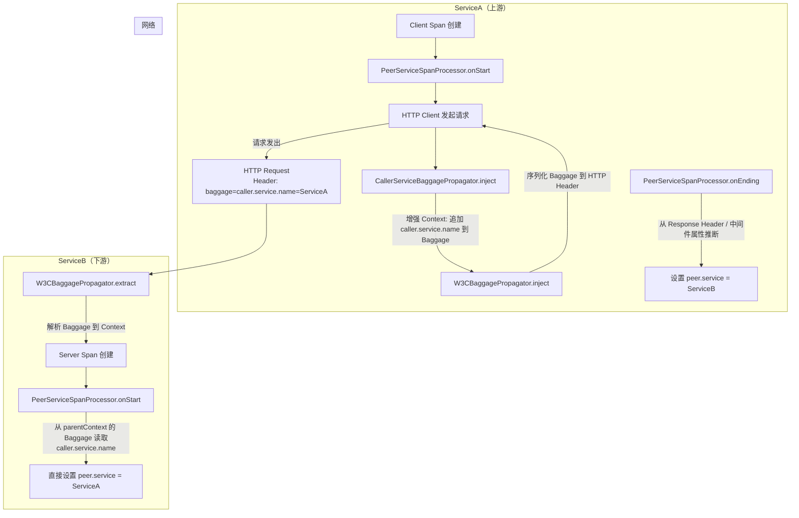
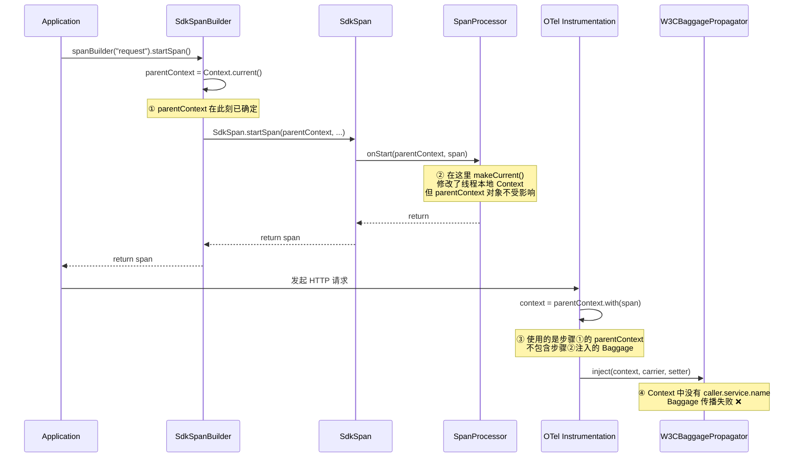
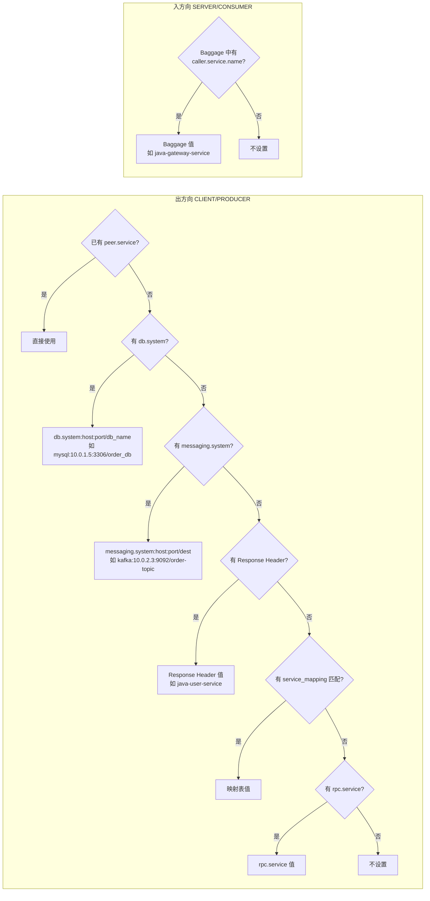

# peer.service 自动填充方案设计与实施经验

## 1. 背景与目标

在分布式链路追踪中，`peer.service` 属性用于标识 Span 的对端服务名称，是可观测后端绘制**服务拓扑图**的关键依据。然而 OTel SDK 默认不会自动填充该属性，需要业务方手动设置，这在实际生产中很难落地。

**目标**：通过 `SpanProcessor` + `TextMapPropagator` 机制，在 Span 生命周期中自动推断并填充 `peer.service`，使可观测后端能正确绘制服务拓扑图，无需业务方手动干预。

## 2. 核心设计

### 2.1 Span 类型与 peer.service 语义

| Span 类型 | 方向 | `peer.service` 含义 | 推断来源 |
|---|---|---|---|
| **CLIENT / PRODUCER** | 出方向 | 我调用的下游服务名 | 中间件属性、Response Header、service_mapping、rpc.service |
| **SERVER / CONSUMER** | 入方向 | 调用我的上游服务名 | Baggage 中的 `caller.service.name` |

### 2.2 出方向推断优先级

对于 CLIENT/PRODUCER Span，按以下优先级依次推断 `peer.service`：

1. **已有 peer.service** → 直接使用（尊重用户手动设置）
2. **中间件类推断（DB）** → `db.system:server.address:server.port/db.name`
   - 示例：`mysql:10.0.1.5:3306/order_db`
3. **中间件类推断（MQ）** → `messaging.system:server.address:server.port/destination`
   - 示例：`kafka:10.0.2.3:9092/order-topic`
4. **Response Header** → 从 `http.response.header.x-otel-service-name` 读取（精确值）
5. **service_mapping** → 通过 `server.address:server.port` 在映射表中查找
6. **rpc.service** → 直接使用 RPC 服务名

> **设计决策**：DB 和 MQ 的 peer.service 包含连接地址（`server.address:server.port`），在多集群/多实例场景下更直观地区分不同实例。地址优先使用新版语义约定 `server.address`，降级到旧版 `net.peer.name`。

### 2.3 整体架构



## 3. 核心组件

### 3.1 PeerServiceSpanProcessor

实现 `ExtendedSpanProcessor` 接口，在 Span 生命周期的不同阶段处理不同类型的 Span：

- **`onStart(parentContext, span)`**：对 SERVER/CONSUMER Span，直接从 `parentContext` 的 Baggage 中读取 `caller.service.name` 并设置 `peer.service`。在 `onStart` 中处理是因为此时可以同时访问 Context（Baggage）和 ReadWriteSpan，无需引入临时属性
- **`onEnding(span)`**：仅处理 CLIENT/PRODUCER Span，按优先级推断 `peer.service`（需要等待 Response Header 等属性就绪）

### 3.2 CallerServiceBaggagePropagator

`TextMapPropagator` 装饰器（装饰器模式），包装原始的组合传播器：

- **`inject(context, carrier, setter)`**：将 `caller.service.name` 追加到 Context 的 Baggage 中，构建增强后的 Context，再委托给原始传播器执行实际注入
- **`extract(context, carrier, getter)`**：直接委托给原始传播器，不做额外处理

### 3.3 PeerServiceResolverConfig

配置类，支持以下配置项：

| 配置项 | 默认值 | 说明 |
|---|---|---|
| `otel.agent.peer.service.enabled` | `true` | 是否启用 peer.service 自动填充 |
| `otel.agent.peer.service.mapping` | 空 | 服务映射（格式: `address1=service1,address2=service2`） |
| `otel.agent.peer.service.response.header.name` | `x-otel-service-name` | Response Header 名称 |
| `otel.agent.peer.service.baggage.key` | `caller.service.name` | Baggage 中传递调用方服务名的 key |

### 3.4 注册方式

在 `ControlPlaneAutoConfigurationProvider` 中：

- `PeerServiceSpanProcessor` 通过 `addTracerProviderCustomizer` → `builder.addSpanProcessor()` 注册
- `CallerServiceBaggagePropagator` 通过 `addPropagatorCustomizer` 注册（装饰原始传播器）

## 4. 踩坑经验

### 4.1 ❌ SpanProcessor.onStart() 中 Baggage.makeCurrent() 无法传播

**问题描述**：最初方案是在 `CallerServiceBaggageSpanProcessor.onStart()` 中通过 `Baggage.makeCurrent()` 将 `caller.service.name` 注入到当前线程的 Context 中，期望 `W3CBaggagePropagator` 在 inject 时能读取到。

**根因分析**：



**关键点**：OTel Instrumentation 在传播时使用的 Context 是 `parentContext.with(span)`，而 `parentContext` 在 `spanBuilder().startSpan()` 调用时就已经确定了。`SpanProcessor.onStart()` 中通过 `makeCurrent()` 修改的是线程本地 Context，**不会影响已经捕获的 `parentContext` 对象**（Context 是不可变的）。

**解决方案**：改为在 `TextMapPropagator.inject()` 阶段注入 Baggage（方案 B），因为 inject 是传播链路的最后一步，此时增强 Context 中的 Baggage 能确保被正确序列化到 HTTP Header 中。

### 4.2 ❌ Response Header 属性类型不匹配

**问题描述**：Client Span 中明明有 `http.response.header.x-otel-service-name = ["java-user-service"]`，但 `resolveFromResponseHeader` 返回 null，导致 peer.service 未设置。

**根因分析**：OTel HTTP Instrumentation 捕获的 Response Header 存储为 **`List<String>` 类型**（`AttributeKey<List<String>>`），而代码中使用 `AttributeKey.stringKey()` 读取，类型不匹配导致返回 null。

```
// Span 中实际存储的类型
AttributeKey<List<String>> → ["java-user-service"]

// 代码中错误的读取方式
AttributeKey<String> → null（类型不匹配）
```

**解决方案**：`resolveFromResponseHeader` 方法优先尝试 `AttributeKey.stringArrayKey()`（`List<String>` 类型），取第一个元素；降级到 `AttributeKey.stringKey()`（`String` 类型）以兼容自定义场景。

### 4.3 ❌ `setAttribute(key, null)` 无法删除属性

**问题描述**：最初方案在 `onStart()` 中将 Baggage 值缓存为临时属性 `_internal.caller.service.name`，在 `onEnding()` 中读取后通过 `span.setAttribute(key, null)` 尝试清除。但实际测试发现临时属性仍然出现在最终导出的 Span 中。

**根因分析**：`SdkSpan.setAttribute()` 方法在 value 为 null 时直接 return，不做任何操作：

```java
// SdkSpan.java 第 325 行
if (key == null || key.getKey().isEmpty() || value == null) {
    return this;
}
```

这意味着 `setAttribute(key, null)` **无法删除已设置的属性**，OTel SDK 的 `ReadWriteSpan` 接口也没有提供 `removeAttribute` API。

**解决方案**：重新审视设计，将 SERVER/CONSUMER 的 `peer.service` 设置逻辑从 `onEnding()` 移到 `onStart()`。因为 `onStart()` 能同时访问 `parentContext`（Baggage）和 `ReadWriteSpan`，可以直接设置 `peer.service`，**从根本上消除了对临时属性的需求**。

### 4.4 Response Header 属性清理的局限性

对于 CLIENT/PRODUCER Span，`http.response.header.x-otel-service-name` 属性在设置完 `peer.service` 后尝试通过 `span.setAttribute(key, null)` 清除，但由于上述 SDK 限制，该属性仍会保留在 Span 中。这是一个已知的局限性，但该属性本身是 OTel HTTP Instrumentation 标准行为产生的，保留在 Span 中不会造成语义混淆。

## 5. 数据流全景图



## 6. 配置示例

```properties
# 启用 peer.service 自动填充（默认 true）
otel.agent.peer.service.enabled=true

# 服务映射（地址 → 服务名）
otel.agent.peer.service.mapping=10.0.1.5:3306=order-mysql,10.0.2.3:9092=order-kafka,10.0.3.1:6379=cache-redis

# Response Header 名称（默认 x-otel-service-name）
otel.agent.peer.service.response.header.name=x-otel-service-name

# Baggage key（默认 caller.service.name）
otel.agent.peer.service.baggage.key=caller.service.name

# 确保 Propagator 包含 baggage（必须）
OTEL_PROPAGATORS=tracecontext,baggage
```

## 7. 文件清单

| 文件 | 说明 |
|---|---|
| `peerservice/PeerServiceSpanProcessor.java` | 核心处理器，实现 ExtendedSpanProcessor，在 onEnding 中填充 peer.service |
| `peerservice/CallerServiceBaggagePropagator.java` | TextMapPropagator 装饰器，在 inject 时注入 caller.service.name 到 Baggage |
| `peerservice/PeerServiceResolverConfig.java` | 配置类，持有 service_mapping、开关等配置 |
| `peerservice/package-info.java` | 包文档 |
| `spi/ControlPlaneAutoConfigurationProvider.java` | SPI 注册入口，注册 Processor 和 Propagator |
