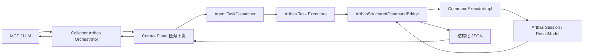
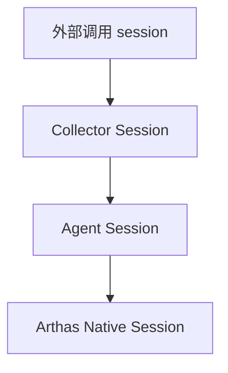
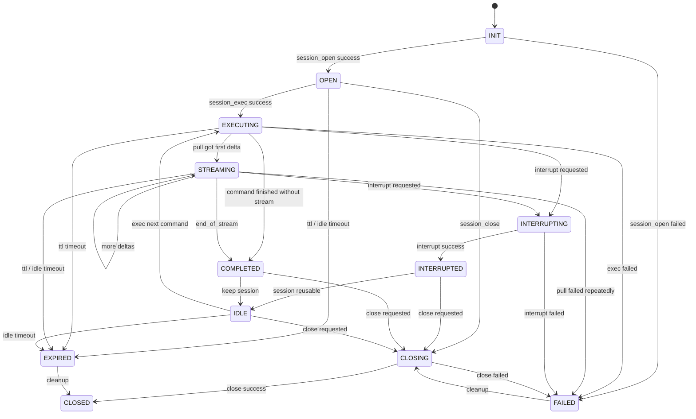
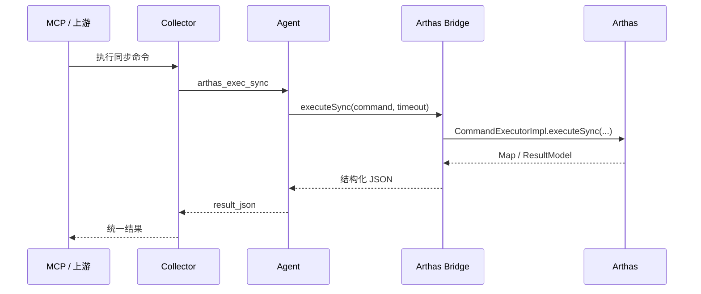
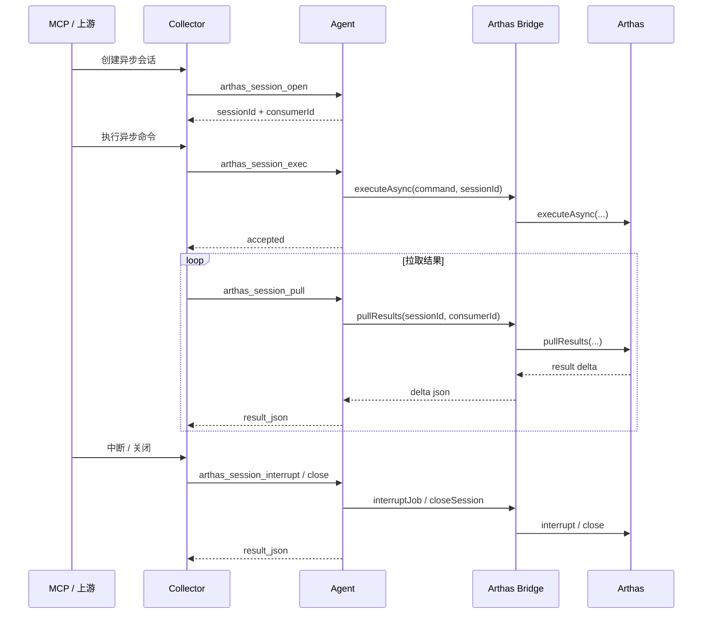

## Arthas Collector / Agent 双端协议设计

## 1. 背景

当前已经确定 Agent 侧采用 **Arthas 内嵌结构化执行桥接** 方案：

- 不暴露 Arthas HTTP 端口
- 不走 RAW 文本解析
- 直接复用 Arthas 内部 `CommandExecutorImpl`
- 在 Arthas ClassLoader 内将执行结果序列化为 JSON
- 对外输出稳定结构化结果，便于 Collector / MCP / LLM 消费

在此基础上，需要继续定义一套 **Collector / Agent 双端协议**，解决以下问题：

- Collector 如何下发 Arthas 命令
- Agent 如何区分同步命令与异步会话命令
- `task_type`、`parameters_json`、`result_json` 如何设计
- session 生命周期如何管理
- 超时、重试、幂等与失败语义如何定义

本文档用于定义一版 **可落地的双端协议设计**。

配套实施路线请参考：

- [Arthas Collector / Agent 双端实施 Roadmap](./arthas-collector-agent-roadmap.md)

## 2. 设计目标

本协议设计目标如下：

- 复用现有 Control Plane 的任务下发与结果回传链路
- 不新增 Agent 侧对外监听端口
- 兼容当前 `TaskExecutor` 机制
- 同时支持：
  - 查询型同步命令
  - 长任务异步命令
  - 多轮拉取式结果消费
  - 中断与关闭会话
- 保持 Collector / Agent 职责清晰，避免 Collector 直接处理 Arthas RAW 输出
- 对 LLM 暴露稳定 JSON 协议，而不是 Arthas 内部类模型

## 3. 总体方案

### 3.1 总体结论

采用如下设计：

- **传输层**：复用当前 Control Plane 任务链路
- **协议层**：定义一套 Arthas 专用任务协议
- **执行层**：Agent 内通过 `ArthasStructuredCommandBridge` 调用 Arthas 内部 `CommandExecutorImpl`
- **结果层**：
  - 同步命令：单任务终态返回
  - 异步命令：通过 session 化任务进行多轮拉取

即：

- 不单独维护新的物理通道
- 不把流式输出强塞进当前 `RUNNING` 状态
- 而是在现有任务模型之上，定义一层 **Arthas 会话协议**

## 4. 架构图



## 5. 职责划分

### 5.1 Collector 职责

Collector 负责：

- 接收 MCP / 上层调用请求
- 将 Arthas 请求编排为 Control Plane 任务
- 管理 Collector 视角的 session 映射
- 处理任务超时、重试策略、幂等控制
- 聚合 Agent 返回的结构化 JSON
- 向上游返回统一结果

Collector **不负责**：

- 解析 Arthas RAW 文本
- 直接理解 Arthas 内部类结构
- 自己维护一套长连接终端通道

### 5.2 Agent 职责

Agent 负责：

- 接收并执行 Arthas 任务
- 调用 `ArthasStructuredCommandBridge`
- 将 Arthas 内部结构化结果转换为稳定 JSON
- 维护 Agent 本地 session 生命周期
- 管理异步结果缓冲、游标和回收
- 按协议返回 `result_json`

Agent **不负责**：

- 维护跨 Agent 的全局会话
- 理解 LLM 特定语义
- 对外暴露 Arthas HTTP API

## 6. 任务类型设计

定义如下 `task_type`：

| task_type | 用途 | 是否会话化 | 推荐阶段 |
|---|---|---:|---|
| `arthas_attach` | 启动 / 接入 Arthas | 否 | Phase 1 |
| `arthas_detach` | 停止 / 断开 Arthas | 否 | Phase 1 |
| `arthas_exec_sync` | 执行同步查询命令 | 否 | Phase 1 |
| `arthas_session_open` | 创建异步会话 | 是 | Phase 2 |
| `arthas_session_exec` | 在指定 session 中启动异步命令 | 是 | Phase 2 |
| `arthas_session_pull` | 拉取异步结果增量 | 是 | Phase 2 |
| `arthas_session_interrupt` | 中断异步任务 | 是 | Phase 2 |
| `arthas_session_close` | 关闭会话并回收资源 | 是 | Phase 2 |

## 7. 同步命令协议

### 7.1 `arthas_exec_sync`

适用场景：

- `thread`
- `jad`
- `sc`
- `sm`
- `tt -l`
- 其他一次执行一次返回的命令

### 7.2 parameters_json

建议结构：

```json
{
  "command": "thread -n 5",
  "timeout_ms": 30000,
  "user_id": "collector-user",
  "auth_subject": null,
  "session_id": null,
  "auto_attach": true,
  "require_tunnel_ready": true,
  "result_limit_bytes": 1048576
}
```

字段说明：

| 字段 | 类型 | 必填 | 说明 |
|---|---|---:|---|
| `command` | string | 是 | Arthas 命令字符串 |
| `timeout_ms` | number | 否 | 命令执行超时，默认 30000 |
| `user_id` | string | 否 | 记录操作者身份 |
| `auth_subject` | object/null | 否 | 透传给 Arthas |
| `session_id` | string/null | 否 | 缺省为 one-time session |
| `auto_attach` | boolean | 否 | 未启动 Arthas 时是否自动 attach |
| `require_tunnel_ready` | boolean | 否 | 是否要求 Arthas 已处于可交互就绪 |
| `result_limit_bytes` | number | 否 | 本次允许返回的结果大小上限 |

### 7.3 result_json

建议统一 envelope：

```json
{
  "success": true,
  "taskType": "arthas_exec_sync",
  "command": "thread -n 5",
  "sessionId": null,
  "timeout": false,
  "errorCode": "",
  "errorMessage": "",
  "payload": {
    "resultCount": 1,
    "results": []
  },
  "rawJson": "{...}",
  "meta": {
    "agentId": "agent-1",
    "executionTimeMs": 124,
    "arthasState": "RUNNING"
  }
}
```

字段说明：

| 字段 | 类型 | 说明 |
|---|---|---|
| `success` | boolean | 是否执行成功 |
| `taskType` | string | 当前任务类型 |
| `command` | string | 原始命令 |
| `sessionId` | string/null | session 标识 |
| `timeout` | boolean | 是否超时 |
| `errorCode` | string | 错误码 |
| `errorMessage` | string | 错误信息 |
| `payload` | object | 结构化结果主体 |
| `rawJson` | string | Arthas 原始结构化 JSON |
| `meta` | object | 执行元信息 |

## 8. 异步会话协议

异步协议适用于：

- `watch`
- `trace`
- `stack`
- 持续输出类命令
- 需要中断的长任务

### 8.1 `arthas_session_open`

用于在 Agent 上创建一个逻辑 session。

#### parameters_json

```json
{
  "user_id": "collector-user",
  "ttl_ms": 300000,
  "idle_timeout_ms": 60000,
  "auto_attach": true,
  "require_tunnel_ready": false
}
```

#### result_json

```json
{
  "success": true,
  "taskType": "arthas_session_open",
  "session": {
    "sessionId": "asess-123",
    "consumerId": "consumer-456",
    "state": "OPEN",
    "ttlMs": 300000,
    "idleTimeoutMs": 60000,
    "createdAt": 1760000000000
  },
  "errorCode": "",
  "errorMessage": ""
}
```

### 8.2 `arthas_session_exec`

在指定 session 中发起异步命令。

#### parameters_json

```json
{
  "session_id": "asess-123",
  "command": "watch com.foo.Bar baz '{params,returnObj}' -x 2",
  "user_id": "collector-user",
  "replace_existing_job": false,
  "timeout_ms": 30000
}
```

#### result_json

```json
{
  "success": true,
  "taskType": "arthas_session_exec",
  "sessionId": "asess-123",
  "job": {
    "accepted": true,
    "state": "EXECUTING",
    "command": "watch com.foo.Bar baz '{params,returnObj}' -x 2"
  },
  "errorCode": "",
  "errorMessage": ""
}
```

### 8.3 `arthas_session_pull`

拉取该 session 下尚未消费的结构化结果。

#### parameters_json

```json
{
  "session_id": "asess-123",
  "consumer_id": "consumer-456",
  "wait_timeout_ms": 10000,
  "max_items": 50,
  "max_bytes": 524288
}
```

#### result_json

```json
{
  "success": true,
  "taskType": "arthas_session_pull",
  "sessionId": "asess-123",
  "consumerId": "consumer-456",
  "delta": {
    "items": [],
    "count": 0,
    "hasMore": false,
    "endOfStream": false,
    "nextCursor": "cursor-001"
  },
  "errorCode": "",
  "errorMessage": "",
  "meta": {
    "waitedMs": 10000
  }
}
```

### 8.4 `arthas_session_interrupt`

用于中断异步执行中的 job。

#### parameters_json

```json
{
  "session_id": "asess-123",
  "reason": "collector_cancelled"
}
```

#### result_json

```json
{
  "success": true,
  "taskType": "arthas_session_interrupt",
  "sessionId": "asess-123",
  "interrupted": true,
  "state": "INTERRUPTED",
  "errorCode": "",
  "errorMessage": ""
}
```

### 8.5 `arthas_session_close`

用于主动关闭 session 并释放资源。

#### parameters_json

```json
{
  "session_id": "asess-123",
  "force": false,
  "reason": "completed"
}
```

#### result_json

```json
{
  "success": true,
  "taskType": "arthas_session_close",
  "sessionId": "asess-123",
  "closed": true,
  "state": "CLOSED",
  "errorCode": "",
  "errorMessage": ""
}
```

## 9. Collector / Agent 会话映射

Collector 不直接暴露 Agent 的原始 session 概念给外部调用方，建议增加一层映射：



映射关系建议：

| 层级 | 标识 | 作用 |
|---|---|---|
| 外部调用层 | `client_session_id` | 给 MCP / 上游使用 |
| Collector 层 | `collector_session_id` | Collector 内部编排标识 |
| Agent 层 | `agent_session_id` | Agent 本地 session 标识 |
| Arthas 层 | `arthas sessionId / consumerId` | Arthas 内部会话标识 |

Collector 最少需要维护：

```json
{
  "collector_session_id": "c-123",
  "agent_id": "agent-1",
  "agent_session_id": "asess-123",
  "consumer_id": "consumer-456",
  "state": "OPEN",
  "created_at": 1760000000000,
  "last_access_at": 1760000005000
}
```

## 10. Session 状态机

### 10.1 状态定义

| 状态 | 含义 |
|---|---|
| `INIT` | Collector 已接收请求，但 Agent session 尚未建立 |
| `OPEN` | Agent session 已创建，但还未执行命令 |
| `EXECUTING` | 已提交异步命令，正在运行 |
| `STREAMING` | 正在持续拉取结果 |
| `IDLE` | 当前无执行任务，session 仍可复用 |
| `INTERRUPTING` | 正在中断 job |
| `INTERRUPTED` | job 已被中断 |
| `COMPLETED` | 当前 job 已结束，session 可选择保留或关闭 |
| `CLOSING` | 正在关闭 session |
| `CLOSED` | session 已关闭 |
| `EXPIRED` | 超过 TTL 或 idle timeout，被系统回收 |
| `FAILED` | 会话级错误，无法继续使用 |

### 10.2 状态机图



## 11. 时序图

### 11.1 同步命令时序



### 11.2 异步会话时序



## 12. 参数与结果字段约束

### 12.1 公共 parameters_json 字段

所有 Arthas 任务建议支持以下公共字段：

| 字段 | 类型 | 说明 |
|---|---|---|
| `user_id` | string | 操作者 |
| `timeout_ms` | number | 单任务超时 |
| `trace_id` | string | 便于跨端日志关联 |
| `auto_attach` | boolean | 是否自动启动 Arthas |
| `require_tunnel_ready` | boolean | 是否要求 tunnel ready |
| `result_limit_bytes` | number | 单次结果大小限制 |

### 12.2 公共 result_json 字段

所有 Arthas 任务建议统一返回：

```json
{
  "success": true,
  "taskType": "arthas_xxx",
  "errorCode": "",
  "errorMessage": "",
  "meta": {}
}
```

通用字段建议：

| 字段 | 类型 | 说明 |
|---|---|---|
| `success` | boolean | 是否成功 |
| `taskType` | string | 任务类型 |
| `errorCode` | string | 错误码 |
| `errorMessage` | string | 错误信息 |
| `meta` | object | 执行元数据 |

## 13. 错误码设计

### 13.1 初始化类错误

| error_code | 说明 |
|---|---|
| `ARTHAS_NOT_RUNNING` | Arthas 未运行 |
| `ARTHAS_CLASSLOADER_UNAVAILABLE` | Arthas ClassLoader 不存在 |
| `ARTHAS_BOOTSTRAP_UNAVAILABLE` | Bootstrap 实例不存在 |
| `SESSION_MANAGER_UNAVAILABLE` | SessionManager 获取失败 |
| `COMMAND_EXECUTOR_INIT_FAILED` | CommandExecutorImpl 初始化失败 |

### 13.2 执行类错误

| error_code | 说明 |
|---|---|
| `INVALID_PARAMETERS` | 参数错误 |
| `COMMAND_EXECUTION_FAILED` | 命令执行失败 |
| `COMMAND_TIMEOUT` | 命令执行超时 |
| `SESSION_NOT_FOUND` | session 不存在 |
| `SESSION_ALREADY_CLOSED` | session 已关闭 |
| `SESSION_NOT_IDLE` | session 当前不可执行新命令 |
| `ASYNC_JOB_INTERRUPTED` | 异步任务已中断 |
| `PULL_RESULT_FAILED` | 拉取结果失败 |
| `RESULT_TOO_LARGE` | 结果超过大小限制 |

### 13.3 状态类错误

| error_code | 说明 |
|---|---|
| `ARTHAS_NOT_READY` | Arthas 未就绪 |
| `TUNNEL_NOT_READY` | tunnel 未注册 |
| `SESSION_EXPIRED` | session 已过期 |
| `SESSION_TTL_EXCEEDED` | session 总存活时间超过限制 |
| `SESSION_IDLE_TIMEOUT` | session 空闲超时 |

### 13.4 序列化类错误

| error_code | 说明 |
|---|---|
| `RESULT_JSON_SERIALIZATION_FAILED` | JSON 序列化失败 |
| `RESULT_JSON_PARSE_FAILED` | JSON 解析失败 |

## 14. 超时语义

协议中需要区分以下超时：

### 14.1 attach 超时

- 适用于 `arthas_attach`
- 含义：Arthas 启动或 tunnel 注册未在预期时间内完成
- 推荐错误码：`ARTHAS_ATTACH_TIMEOUT`

### 14.2 command 超时

- 适用于 `arthas_exec_sync`
- 含义：`executeSync` 未在 `timeout_ms` 内完成
- 推荐错误码：`COMMAND_TIMEOUT`

### 14.3 pull 等待超时

- 适用于 `arthas_session_pull`
- 含义：在 `wait_timeout_ms` 内没有新数据
- **不视为失败**
- 应返回：
  - `success=true`
  - `items=[]`
  - `hasMore=false`
  - `endOfStream=false`

### 14.4 session TTL 超时

- 适用于整个异步会话
- 含义：从 `session_open` 起累计生命周期超限
- 返回错误码：`SESSION_TTL_EXCEEDED`

### 14.5 idle timeout

- 适用于会话空闲回收
- 含义：长时间未 pull / 未 exec / 未访问
- 返回错误码：`SESSION_IDLE_TIMEOUT`

## 15. 失败重试语义

### 15.1 总原则

重试要区分：

- **协议可重试**
- **业务不可重试**
- **幂等安全**
- **非幂等风险**

### 15.2 Collector 侧重试建议

| task_type | 是否建议自动重试 | 说明 |
|---|---:|---|
| `arthas_attach` | 是 | 启动失败可有限重试 |
| `arthas_detach` | 是 | 幂等性较强 |
| `arthas_exec_sync` | 否 | 可能重复执行命令 |
| `arthas_session_open` | 是 | 可通过幂等键避免重复创建 |
| `arthas_session_exec` | 否 | 避免重复提交异步作业 |
| `arthas_session_pull` | 是 | 读取型操作，适合重试 |
| `arthas_session_interrupt` | 是 | 幂等性较强 |
| `arthas_session_close` | 是 | 幂等性较强 |

### 15.3 重试次数建议

建议：

- `attach`：最多 2 次
- `session_open`：最多 2 次
- `pull`：最多 3 次
- `interrupt` / `close`：最多 2 次
- `exec_sync` / `session_exec`：默认 0 次自动重试

### 15.4 幂等键建议

对于可能重试的任务，建议在 `parameters_json` 中增加：

```json
{
  "request_id": "req-123456"
}
```

Agent 可基于 `request_id + task_type + session_id` 做幂等控制。

### 15.5 `session_pull` 的重试语义

`session_pull` 是只读操作，推荐这样处理：

- 网络错误：可直接重试
- 空结果：不重试，按正常空轮询返回
- session 不存在：不重试，直接失败
- 临时序列化错误：可有限重试

## 16. TaskStatus 与 result_json 的配合语义

由于当前任务体系中：

- `RUNNING` 适合表达任务进行中
- 终态才适合携带业务结果

因此建议如下：

### 16.1 对同步任务

- `RUNNING`：表示任务开始执行
- `SUCCESS/FAILED/TIMEOUT/CANCELLED`：携带最终 `result_json`

### 16.2 对异步会话任务

#### `arthas_session_exec`
- `RUNNING`：表示已受理并发起执行
- `SUCCESS`：表示“受理成功”，不表示结果流结束

#### `arthas_session_pull`
- 每次 pull 都是一个独立任务
- 任务本身返回 `SUCCESS`
- `delta.endOfStream=true` 才表示当前异步命令真正结束

即：

- **任务成功 != 异步命令已结束**
- **pull 返回 EOS 才是命令完成信号**

## 17. Agent 本地缓存与回收建议

Agent 侧建议维护 `ArthasSessionRegistry`，每个 session 记录：

```json
{
  "sessionId": "asess-123",
  "consumerId": "consumer-456",
  "state": "STREAMING",
  "currentCommand": "watch ...",
  "createdAt": 1760000000000,
  "lastAccessAt": 1760000005000,
  "ttlMs": 300000,
  "idleTimeoutMs": 60000,
  "bufferedItems": 12,
  "endOfStream": false
}
```

回收策略建议：

- session closed：立即清理
- session expired：后台定时清理
- interrupted/completed 且长时间未访问：转为 idle 后清理
- 结果缓冲超过阈值：触发截断或拒绝继续拉取

## 18. 推荐实施顺序

### Phase 1

先实现：

- `arthas_exec_sync`
- `arthas_attach`
- `arthas_detach`

这样即可覆盖大量查询型 MCP 场景。

### Phase 2

再实现：

- `arthas_session_open`
- `arthas_session_exec`
- `arthas_session_pull`
- `arthas_session_interrupt`
- `arthas_session_close`

这样即可支持 `watch / trace / stack` 等持续输出场景。

### Phase 3

最后视需要增强：

- 更细的流量控制
- 大结果分页 / 分片
- 更完整的幂等去重
- Collector 侧会话编排器抽象

## 19. 最终结论

Arthas Collector / Agent 双端协议应采用如下原则：

- **复用现有 Control Plane 任务链路**
- **不新增独立物理通道**
- **同步命令走单任务单结果**
- **异步命令走 session 化任务协议**
- **Collector 负责编排，Agent 负责执行与本地会话管理**
- **对上游统一暴露稳定 JSON，而不是 Arthas RAW 文本或内部类对象**

这套协议既能兼容当前 Control Plane 体系，又能为后续 Arthas 会话能力扩展提供稳定基础。
