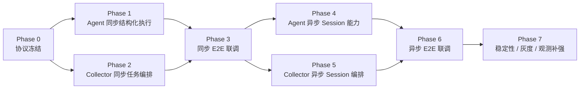
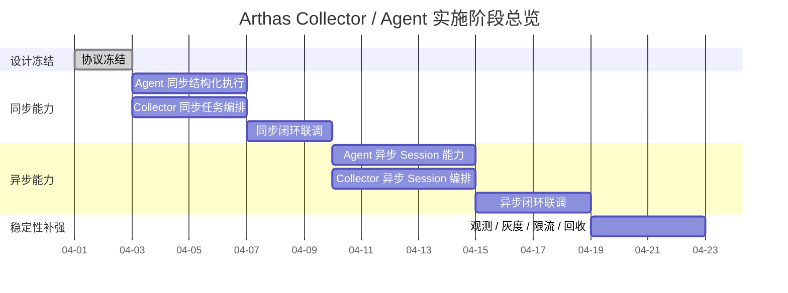

## Arthas Collector / Agent 双端实施 Roadmap

## 1. 背景

当前已经完成两类核心方案设计：

- [Arthas 结构化命令执行方案（反射桥接版）](./arthas-structured-command-bridge-design.md)
- [Arthas Collector / Agent 双端协议设计](./arthas-collector-agent-protocol-design.md)

其中已经明确：

- Agent 侧通过 `ArthasStructuredCommandBridge` 反射复用 Arthas 内部 `CommandExecutorImpl`
- Collector / Agent 之间复用现有 Control Plane 任务链路
- 同步命令走单任务单结果
- 异步命令走 session 化协议

接下来需要把方案从“设计完成”推进到“可执行实施”，因此需要一份明确的双端 roadmap，指导后续分阶段开发、联调和灰度上线。

## 2. 实施目标

roadmap 的目标如下：

- 明确 Collector / Agent 两侧实施边界
- 明确推荐开发顺序与并行关系
- 降低同步 / 异步能力混合推进带来的返工风险
- 先尽快交付同步结构化命令 MVP
- 再逐步补齐异步 session、稳定性与观测能力

## 3. 总体实施策略

核心策略只有一句话：

- **先打通同步闭环，再补异步会话；先打通 Agent 执行能力，再补 Collector 编排能力**

对应为：

1. 协议冻结
2. Agent 同步结构化执行 MVP
3. Collector 同步任务编排 MVP
4. 同步闭环联调
5. Agent 异步 session 能力
6. Collector 异步 session 编排
7. 异步闭环联调
8. 稳定性、灰度、观测补强

## 4. 总体 roadmap 图

## 5. 分阶段实施计划

## 5.1 Phase 0：协议冻结

这一阶段不追求快速写代码，而是先把边界锁死，避免后续 Collector 和 Agent 两边同时返工。

### Agent 侧

- 冻结结构化桥接主路径：
  - `getArthasClassLoader()`
  - `getBootstrapInstance()`
  - `getSessionManager()`
  - `CommandExecutorImpl`
- 冻结同步执行入口：
  - `executeSync(...)`
- 冻结异步能力边界：
  - `createSession(...)`
  - `executeAsync(...)`
  - `pullResults(...)`
  - `interruptJob(...)`
  - `closeSession(...)`

### Collector 侧

- 冻结 `task_type`：
  - `arthas_attach`
  - `arthas_detach`
  - `arthas_exec_sync`
  - `arthas_session_open`
  - `arthas_session_exec`
  - `arthas_session_pull`
  - `arthas_session_interrupt`
  - `arthas_session_close`
- 冻结 `parameters_json` / `result_json`
- 冻结超时、重试、幂等语义

### 验收标准

- 协议字段不再频繁变动
- 同步 / 异步能力边界清晰
- V1 不新增新的物理通道

## 5.2 Phase 1：Agent 同步结构化执行 MVP

这一阶段优先解决“RAW 不可消费”的核心问题，让 Agent 可以直接返回结构化结果。

### Agent 侧目标

把 Arthas 命令执行从：

- RAW 终端输出

切换为：

- 稳定结构化 JSON 输出

### Agent 侧任务

- 新增 `ArthasStructuredCommandBridge`
- 实现 `executeSync(...)`
- 通过反射构造 `CommandExecutorImpl`
- 在 Arthas ClassLoader 内完成 JSON 序列化
- 定义统一返回 envelope，例如：
  - `success`
  - `command`
  - `sessionId`
  - `timeout`
  - `payload`
  - `rawJson`
- 补充错误码：
  - 初始化失败
  - 执行失败
  - 命令超时
  - 序列化失败
- 补充桥接层日志：
  - 初始化耗时
  - 反射调用耗时
  - 序列化耗时
  - 超时日志

### 这一阶段先不要做

- 不做异步 session
- 不做 `watch` / `trace` / `stack`
- 不做复杂的大结果分页
- 不做过多多版本 fallback 分支

### 验收标准

- `thread` / `jad` / `sc` / `sm` 可稳定返回 JSON
- 执行失败和超时具备统一错误结构
- one-time session 自动清理
- 不向业务层暴露 Arthas 内部类

## 5.3 Phase 2：Collector 同步任务编排 MVP

Agent 打通同步结构化执行后，Collector 才能把能力稳定暴露给上游。

### Collector 侧目标

让上游能够通过现有 Control Plane 任务链路调用：

- `arthas_attach`
- `arthas_exec_sync`
- `arthas_detach`

### Collector 侧任务

- 定义 Arthas 任务构造器
  - 组装 `task_type`
  - 组装 `parameters_json`
- 定义同步结果解析器
  - 统一解析 `result_json`
  - 收敛错误码 / timeout 语义
- 封装 `Collector Arthas Orchestrator`
  - attach 检查
  - exec_sync 提交
  - detach 清理
- 向上游先暴露同步查询型命令：
  - `thread`
  - `jad`
  - `sc`
  - `sm`
  - `tt -l`
- 补充 Collector 侧超时和有限重试
  - `attach` 可有限重试
  - `exec_sync` 默认不自动重试

### 验收标准

- Collector 能发起同步 Arthas 任务并拿到结构化结果
- 上游不再依赖 RAW 文本解析
- 超时 / 错误码具备统一映射

## 5.4 Phase 3：同步闭环联调

这是第一阶段最重要的可交付里程碑。

### 联调重点

- `attach -> exec_sync -> result_json -> 上游返回`
- Arthas 未就绪场景
- 重复 `attach` / `detach` 场景
- 命令失败场景
- 命令超时场景
- 大结果返回场景

### 建议验收命令集

- 轻量命令：
  - `version`
  - `sysprop`
- 结构化查询：
  - `thread`
  - `sc`
  - `sm`
- 大结果命令：
  - `jad`

### 阶段产出

- 同步命令 MVP 可灰度
- 文档与实际行为对齐
- 错误码与状态语义闭环

## 5.5 Phase 4：Agent 异步 Session 能力

同步能力稳定后，再补长任务与持续输出类命令。

### Agent 侧目标

支持以下异步命令：

- `watch`
- `trace`
- `stack`
- 持续输出类命令
- 需要主动中断的长任务

### Agent 侧任务

- 实现 `ArthasSessionRegistry`
- 管理以下会话元数据：
  - `sessionId`
  - `consumerId`
  - `state`
  - `createdAt`
  - `lastAccessAt`
  - `ttlMs`
  - `idleTimeoutMs`
- 实现：
  - `createSession()`
  - `executeAsync()`
  - `pullResults()`
  - `interruptJob()`
  - `closeSession()`
- 实现本地结果缓冲
  - 建议使用有界缓冲区
- 实现 TTL / idle timeout 回收
- 实现 `endOfStream` / `hasMore` / `cursor` 语义

### 风险点

- 结果堆积导致内存膨胀
- session 未关闭导致资源泄漏
- `pull` 与 `interrupt` 并发竞态
- 大结果分批输出的一致性问题

### 验收标准

- `watch` / `trace` / `stack` 可异步执行
- 可多轮 `pull` 拉取结果
- 可 `interrupt`
- 可 `close`
- session 可自动过期清理

## 5.6 Phase 5：Collector 异步 Session 编排

这一阶段解决会话编排问题，而不是把流式输出强行塞进单个任务模型。

### Collector 侧目标

实现 session 化协议编排：

- `openSession`
- `executeAsync`
- `pullResults`
- `interrupt`
- `closeSession`

### Collector 侧任务

- 实现 `Collector Session Manager`
- 管理以下映射信息：
  - `collector_session_id`
  - `agent_id`
  - `agent_session_id`
  - `consumer_id`
  - `state`
- 实现轮询与 backoff 策略
- 实现 Collector 侧 TTL / idle 回收
- 实现会话级错误映射
- 实现基于 `request_id` 的幂等控制

### 不建议做的事

- 不要把持续结果塞进任务 `RUNNING` 状态
- 不要新增独立长连接物理通道
- 不要把 Arthas 原生 session 细节直接暴露给最上层

### 验收标准

- Collector 能管理会话生命周期
- 上游可多轮拉取结构化增量结果
- `interrupt` / `close` 语义清晰
- 空轮询不视为失败

## 5.7 Phase 6：异步闭环联调

这是第二个完整能力里程碑。

### 联调重点

- `open -> exec -> pull -> interrupt / close`
- 增量结果是否正确
- `endOfStream` 语义是否正确
- 空 `pull` 是否按协议返回成功
- 重复 `interrupt` / `close` 是否幂等
- session 过期语义是否正确

### 建议重点验证

- 低频 `pull`
- 高频 `pull`
- 大结果输出
- 执行中断
- Collector 侧断线恢复后的会话处理

### 阶段产出

- 异步会话 MVP 可灰度
- Collector / Agent 状态机闭环稳定

## 5.8 Phase 7：稳定性、灰度、观测补强

这一阶段决定能力是否能稳定上线。

### Agent 侧

- 增加 metrics：
  - session 数量
  - active job 数量
  - pull 次数
  - interrupt 次数
  - 结果缓冲大小
- 增加生命周期日志：
  - 命令执行耗时
  - session 创建 / 关闭 / 回收
  - cleanup 执行情况
- 增加保护机制：
  - max session 限制
  - max buffered items / bytes
  - max pull wait timeout

### Collector 侧

- 增加 metrics：
  - task success / fail rate
  - session open / close count
  - pull latency
  - timeout / retry 次数
- 增加降级策略：
  - Agent 不支持结构化桥接时快速失败
  - 结果过大时截断或分页
- 增加灰度策略：
  - 先开放 `exec_sync`
  - 再逐步开放 `watch` / `trace` / `stack`

### 验收标准

- 异常场景可观测
- 资源上限可控
- 可以小流量灰度
- 上线后可快速回滚

## 6. 双端职责拆分

| 维度 | Agent | Collector |
|---|---|---|
| 核心职责 | 执行 Arthas 命令并返回结构化结果 | 编排任务、管理会话、对上游暴露统一接口 |
| 同步命令 | `executeSync` | `arthas_exec_sync` 编排 |
| 异步命令 | `createSession` / `executeAsync` / `pullResults` | `open` / `exec` / `pull` / `interrupt` / `close` 编排 |
| 状态管理 | 本地 session / job 状态 | Collector 侧 session 映射状态 |
| 错误处理 | 执行错误、超时、序列化错误 | 协议错误、重试、超时、会话过期 |
| 性能治理 | buffer / TTL / cleanup | polling / backoff / 限流 |

## 7. 并行推进建议

### 可以并行的部分

- Phase 1：Agent 同步结构化桥接
- Phase 2：Collector 同步任务编排

前提是协议字段已在设计文档中基本冻结。

### 不建议过早并行的部分

- Phase 4：Agent 异步 session
- Phase 5：Collector 异步 session 编排

原因是如果同步闭环尚未稳定，异步阶段返工概率会明显升高。

## 8. 关键风险与应对

- **Arthas 版本兼容风险**：先锁定当前 Arthas 版本，避免 `CommandExecutorImpl` 签名漂移
- **大结果内存风险**：Agent 必须具备缓冲上限与回收机制
- **任务语义错配风险**：不要把流式业务结果塞进任务 `RUNNING`
- **会话泄漏风险**：Collector 和 Agent 两侧都要做 TTL / idle timeout 回收
- **LLM 结果过大风险**：对上游输出时需要保留结构化信息，同时支持裁剪策略

## 9. 最小可交付里程碑

### Milestone 1

- Agent：同步结构化桥接完成
- Collector：`arthas_exec_sync` 编排完成
- 价值：`thread` / `jad` / `sc` / `sm` 等查询类命令即可对外可用

### Milestone 2

- Agent：异步 session 完成
- Collector：session orchestration 完成
- 价值：`watch` / `trace` / `stack` 等长任务可对外可用

## 10. 最终建议

最终建议按以下顺序实施：

1. `arthas_attach`
2. `arthas_exec_sync`
3. `arthas_detach`
4. `arthas_session_open`
5. `arthas_session_exec`
6. `arthas_session_pull`
7. `arthas_session_interrupt`
8. `arthas_session_close`
9. timeout / retry / metrics / cleanup / result limit 补强

这条路径的核心价值在于：

- 先快速交付同步结构化查询能力
- 再稳定扩展到异步 session 场景
- 始终复用现有 Control Plane 任务链路，而不是引入新的物理通道

## 11. 附：实施阶段总览图

