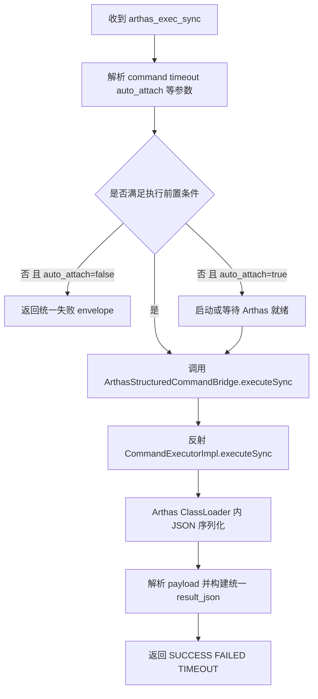

## Arthas Phase 1：Agent 同步结构化执行 MVP 实施记录

## 1. 需求背景

本阶段目标是把 Agent 侧 Arthas 命令执行从 RAW 终端输出切换为稳定结构化 JSON 输出，先打通 `arthas_exec_sync` 的最小闭环。

约束如下：

- 复用当前 Control Plane 任务链路
- 复用 Arthas 内部 `CommandExecutorImpl`
- 不暴露 Arthas 内部类给业务层
- 不引入异步 session 语义
- 保留实施记录、未完成事项与遗留问题

## 2. 本阶段实施范围

- 新增 `ArthasStructuredCommandBridge`
- 新增 `StructuredExecResult`
- 新增 `ArthasExecSyncExecutor`
- 将 `arthas_exec_sync` 注册到 `ArthasIntegration`
- 增加结果 envelope、错误映射、结果大小限制与日志
- 修复 `ArthasStructuredCommandBridge` 对 shaded / unshaded `fastjson2` 的兼容加载
- 改进桥接初始化阶段的 `ClassNotFoundException` 诊断信息
- 补充桥接层单元测试
- 实施完成后执行编译检查

## 3. 实施流程图

## 4. 当前实施进度

- **状态**：已完成本阶段代码实施、桥接兼容修复、单元测试补充、同步闭环联调补测，并通过模块编译校验
- **已完成**：
  - 新增 `ArthasStructuredCommandBridge`
  - 新增 `StructuredExecResult`
  - 新增 `ArthasExecSyncExecutor`
  - 在 `ArthasIntegration` 中注册 `arthas_exec_sync`
  - 增加统一 result envelope、错误映射、结果大小限制与桥接耗时元数据
  - `arthas_exec_sync` 在 Agent 侧缺省将 `require_tunnel_ready` 视为 `false`，未显式传参时按“本地 Arthas ready”语义执行
  - 修复桥接层 `fastjson2` 仅支持未 shading 包名的问题，兼容 `com.alibaba.fastjson2.JSON` 与 `com.alibaba.arthas.deps.com.alibaba.fastjson2.JSON`
  - 改进桥接初始化阶段缺类报错，能够输出具体组件名与候选类名
  - 新增 `ArthasStructuredCommandBridgeTest` 覆盖 shaded `fastjson2` fallback 与缺类诊断信息
  - 完成 `:sdk-extensions:controlplane:compileTestJava` 与 `:sdk-extensions:controlplane:compileJava` 编译校验
  - 完成 Phase 3 同步闭环联调补测，覆盖 `java-user-service`、`test-java-order-service`、`test-java-gateway-service`
  - 验证 `version`、`thread -n 3`、`sc *Controller`、`sm ...`、`jad ... health`、`detach` 等命令主链路可用
  - 验证错误命令、错误类名、监听型长等待命令等失败 / 超时场景的当前返回语义
- **未完成**：Collector 侧编排语义收敛、异步 session 能力、长命令超时链路的端到端统一

## 5. 待办清单

- [x] 新建桥接层与结果模型
- [x] 实现同步执行器
- [x] 接入 `ArthasIntegration`
- [x] 修复 shaded `fastjson2` 兼容问题
- [x] 补充桥接层单元测试
- [x] 执行本轮编译检查并记录结果
- [x] 回填本文档的实施结果
- [x] 补充 Phase 3 同步闭环联调记录
- [ ] 收敛 `attach / detach` 的超时与最终状态返回语义
- [ ] 继续补测长命令超时在 MCP / Collector / Agent 三层的对齐情况

## 6. 编译检查记录

- **命令**：`./gradlew :sdk-extensions:controlplane:compileJava`
- **结果**：`BUILD SUCCESSFUL`
- **说明**：历史实施过程中修复了 `Error Prone` / `NullAway` / `-Werror` 约束，当前以模块编译通过作为本阶段代码正确性的最低门槛
- **本轮命令**：`./gradlew :sdk-extensions:controlplane:compileTestJava :sdk-extensions:controlplane:compileJava`
- **本轮结果**：`BUILD SUCCESSFUL`
- **本轮说明**：已验证桥接兼容修复与新增测试在当前模块下可通过编译
- **本次文档回填后复核命令**：`./gradlew :sdk-extensions:controlplane:compileTestJava :sdk-extensions:controlplane:compileJava`
- **本次文档回填后复核结果**：`BUILD SUCCESSFUL`

## 7. 当前已知风险

- Arthas 反射签名与当前集成版本强绑定
- 结果跨 ClassLoader 序列化需要严格收敛在桥接层
- `auto_attach` 与 `require_tunnel_ready` 的语义需要在执行器中明确区分
- 大结果需要先以硬限制方式保护内存与任务回传
- Collector 若继续下发 `arthas_exec_sync`，应显式传递 `require_tunnel_ready`，避免双端默认值不一致
- 不同 Arthas 打包产物可能继续引入其他 shading 差异，后续联调仍需关注桥接层兼容性
- 首次 `attach` 在多个实例上出现“调用超时但后台成功进入 `tunnel_registered`”现象，Collector 编排层仍需收敛等待语义
- `detach` 在个别实例上也出现“调用超时但后台成功变为 `not_attached`”现象，幂等返回语义仍不稳定
- 长等待命令目前可能先命中 MCP / 上游等待超时，尚未完全验证 Agent `exec_sync` timeout envelope 的端到端上返行为

## 8. 本阶段落地内容

- `ArthasStructuredCommandBridge` 负责：
  - 通过 `getArthasClassLoader()` / `getBootstrapInstance()` 获取 Arthas 入口
  - 反射 `getSessionManager()`
  - 构造 `CommandExecutorImpl`
  - 调用 `executeSync(...)`
  - 在 Arthas ClassLoader 内执行 JSON 序列化
  - 对 `fastjson2` 同时支持未 shading 与 Arthas shading 后的包名加载
  - 当依赖类缺失时返回带组件名与候选类名的初始化失败信息
- `StructuredExecResult` 负责承接桥接层稳定输出，避免 Arthas 内部类型泄漏
- `ArthasExecSyncExecutor` 负责：
  - 参数校验
  - `auto_attach` / `require_tunnel_ready` 前置判定
  - 统一 envelope 构建
  - 结果大小限制
  - 错误码与 timeout 语义映射
  - 当 `require_tunnel_ready` 缺省时，按本地 `RUNNING/IDLE` 就绪语义执行 `exec_sync`
- `ArthasIntegration` 已注册 `arthas_exec_sync` 执行器，并提供桥接器访问入口
- `ArthasStructuredCommandBridgeTest` 已覆盖：
  - shaded `fastjson2` fallback 成功路径
  - 依赖类缺失时的诊断信息

## 9. Phase 3 联调补测记录

### 9.1 联调范围

- 样本实例：
  - `java-user-service`
  - `test-java-order-service`
  - `test-java-gateway-service`
- 已验证命令：
  - `version`
  - `thread -n 3`
  - `sc *Controller`
  - `sm ...`
  - `jad ... health`
  - `detach`

### 9.2 关键结论

- 同步闭环已跑通，`exec_sync` 主链路正常
- 当前未复现 `COMMAND_EXECUTOR_INIT_FAILED`
- 跨实例验证表明：`attach -> exec_sync -> detach` 主链路可用
- 首次 `attach` 存在“请求超时但后台成功”的跨实例共性现象
- `detach` 在个别实例上也出现“请求超时但后台成功”的现象
- 结构化结果返回稳定，但长命令超时的端到端语义仍需继续收敛

### 9.3 失败 / 超时样例

- 不存在类：
  - 示例命令：`jad com.example.notexist.NoSuchClass foo`
  - 当前返回：外层任务成功，Arthas 结果中 `statusCode=-1`，消息为 `No class found for: ...`
- 错误命令：
  - 示例命令：`no_such_command`
  - 当前返回：外层失败，错误码 `COMMAND_EXECUTION_FAILED`
- 长等待命令：
  - 示例命令：`watch ... health`
  - 当前现象：调用侧先命中 10 秒超时，说明上游等待窗口先于部分长命令完成

### 9.4 跨实例补测摘要

| 实例 | attach | exec_sync | detach | 结论 |
|---|---|---|---|---|
| `java-user-service` | 出现空错误 / 超时，但状态最终进入 `tunnel_registered` | 成功 | 曾出现超时但后台成功 | 返回语义需收敛 |
| `test-java-order-service` | 10 秒超时，但状态最终进入 `tunnel_registered` | `version` 成功 | 成功 | 主链路正常 |
| `test-java-gateway-service` | 10 秒超时，但状态最终进入 `tunnel_registered` | `version` 成功 | 成功 | 主链路正常 |

## 10. 遗留问题

- 本阶段不处理异步 session
- 本阶段不处理大结果分页
- 本阶段不处理多版本 fallback 链路
- `attach / detach` 的幂等与等待返回语义仍需在 Collector 编排层继续收敛
- 仍需补充长命令超时在 MCP / Collector / Agent 三层超时窗口的对齐验证
- Collector / Agent 双端仍需在联调中确认 `require_tunnel_ready` 缺省值与超时语义完全一致
- 虽然当前未复现 `COMMAND_EXECUTOR_INIT_FAILED`，但仍需在更多真实运行环境持续观察当前 Arthas 产物下 `CommandExecutorImpl` 初始化稳定性
