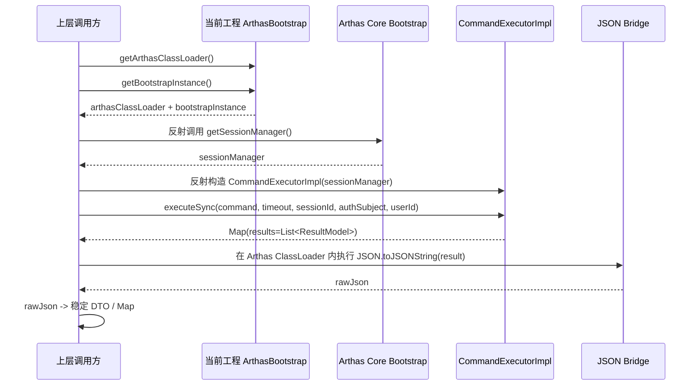
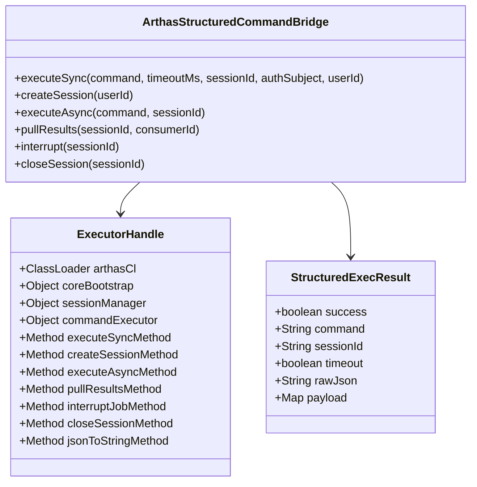

## Arthas 结构化命令执行方案（反射桥接版）

## 1. 背景

当前希望在 Collector/Agent 场景下通过 MCP 与 Arthas 交互，但 Arthas 传统命令输出主要面向终端展示，RAW 文本对 LLM 不够友好，存在以下问题：

- 输出结构不稳定，难以直接做机器消费
- 不同命令格式差异较大，文本解析成本高
- Agent 场景下不适合暴露 HTTP 端口
- 如果在 Collector 侧对 RAW 文本做格式化，会形成较强命令适配耦合

因此需要一个**不依赖 HTTP 暴露端口**、**可直接返回结构化结果**、**尽量复用 Arthas 内部能力**的方案。

## 2. 目标

方案目标：

- 在 Agent 进程内以 **client / bridge** 方式调用 Arthas
- 不依赖 Arthas HTTP 端口
- 不走 RAW 文本解析
- 直接获取 Arthas 内部结构化执行结果
- 对外输出稳定 JSON，便于 MCP / Collector / LLM 消费
- 将 Arthas 反射细节收敛在一层适配器中，不污染业务层

## 3. 结论

最终采用如下主链路：

- 使用当前工程中的 `ArthasBootstrap#getArthasClassLoader()`
- 使用当前工程中的 `ArthasBootstrap#getBootstrapInstance()`
- 反射调用 Arthas 官方 `com.taobao.arthas.core.server.ArthasBootstrap#getSessionManager()`
- 反射构造 `com.taobao.arthas.core.command.CommandExecutorImpl`
- 调用 `executeSync / createSession / executeAsync / pullResults / interruptJob / closeSession`
- 在 **Arthas ClassLoader 内**将结果序列化为 JSON
- 上层统一消费稳定 DTO / Map

> 本方案**不需要** `HttpApiHandler -> 反射 sessionManager 字段` 的 V2 回退路径，只保留直接的 `getSessionManager()` 主路径。

## 4. 方案选型说明

### 4.1 为什么不走 HTTP API

HTTP API 虽然官方已有 JSON 响应能力，但在 Agent 场景下存在明显问题：

- 不适合暴露额外端口
- 需要处理 transport 层对象
- 需要引入或模拟 Netty `ChannelHandlerContext` / `FullHttpRequest`
- 设计上是面向 HTTP 请求，而不是面向内嵌式调用

因此不适合作为 Collector/Agent 内部集成方案。

### 4.2 为什么不做 RAW 转 JSON

如果先执行 Arthas 命令得到 RAW 文本，再由 Collector 侧解析成 JSON，会带来：

- 每个命令都要单独适配
- 输出格式一旦变化容易失效
- 文本解析成本高，维护性差
- 对复杂命令、多段输出、异步输出支持较差

因此不推荐以 RAW 文本解析为主方案。

### 4.3 为什么直接复用 `CommandExecutorImpl`

`CommandExecutorImpl` 已经是 Arthas 内部的统一命令执行抽象，具备以下优势：

- 已封装 session 管理
- 已封装同步 / 异步执行逻辑
- 直接返回 `Map<String, Object>`
- `results` 字段中直接包含 `List<ResultModel>`
- 与 MCP 场景天然契合

因此应优先复用 `CommandExecutorImpl`，而不是复用更上层的 HTTP 处理链路。

## 5. 整体架构

```mermaid
graph LR
    A[OTel ArthasBootstrap] --> B[getArthasClassLoader]
    A --> C[getBootstrapInstance]
    C --> D[Arthas Core Bootstrap.getSessionManager]
    D --> E[new CommandExecutorImpl(sessionManager)]
    E --> F[executeSync / createSession / executeAsync / pullResults]
    F --> G[Map + List<ResultModel>]
    G --> H[Arthas ClassLoader 内 JSON 序列化]
    H --> I[Collector / MCP / LLM]
```

## 6. 时序图



## 7. 核心设计原则

### 7.1 只保留一条执行主路径

主路径固定为：

- `getArthasClassLoader()`
- `getBootstrapInstance()`
- `getSessionManager()`
- `new CommandExecutorImpl(sessionManager)`

不再保留：

- `getHttpApiHandler()`
- 反射 `sessionManager` 字段
- 构造伪 HTTP 请求对象

这样可以减少分支复杂度，降低维护成本。

### 7.2 不跨 ClassLoader 强转

所有 Arthas 内部对象都以反射方式访问，不在业务 ClassLoader 中直接做强制类型转换，例如：

- 不直接 cast 为 `CommandExecutor`
- 不直接操作 `ResultModel` 子类
- 不把 Arthas 内部类暴露给业务接口

统一采用：

- `Object`
- `Method.invoke(...)`
- 在 Arthas ClassLoader 内完成 JSON 序列化

### 7.3 在 Arthas ClassLoader 内做 JSON 序列化

`results` 中的元素来自 Arthas ClassLoader。如果在当前应用 ClassLoader 中直接处理，很容易遇到：

- 同名类不同 ClassLoader
- 反射字段不稳定
- 序列化兼容性差

因此推荐使用 Arthas 自身依赖的：

- `com.alibaba.fastjson2.JSON`

在 Arthas ClassLoader 内调用：

- `JSON.toJSONString(result)`

再把 JSON 字符串回传给上层统一解析。

### 7.4 先落地同步 one-time session

第一阶段优先支持：

- `executeSync(command, timeout, null, authSubject, userId)`

特点：

- `sessionId = null`
- Arthas 自动创建 one-time session
- 命令完成后自动清理 session
- 实现简单，适合大多数查询类命令

### 7.5 异步会话能力作为二阶段增强

第二阶段再补：

- `createSession()`
- `executeAsync(command, sessionId)`
- `pullResults(sessionId, consumerId)`
- `interruptJob(sessionId)`
- `closeSession(sessionId)`

适合：

- `watch`
- `trace`
- `stack`
- 持续输出类命令
- 需要主动中断的长任务

## 8. 模块划分



## 9. 关键依赖接口

### 9.1 当前工程已有能力

当前工程中的 `io.opentelemetry.sdk.extension.controlplane.arthas.ArthasBootstrap` 已具备如下关键接口：

- `getArthasClassLoader()`
- `getBootstrapInstance()`

这两个接口已经足够作为桥接入口。

### 9.2 Arthas 官方能力

Arthas 官方 `com.taobao.arthas.core.server.ArthasBootstrap` 已具备：

- `getSessionManager()`

Arthas 官方 `com.taobao.arthas.core.command.CommandExecutorImpl` 已具备：

- `executeSync(String, long, String, Object, String)`
- `createSession()`
- `executeAsync(String, String)`
- `pullResults(String, String)`
- `interruptJob(String)`
- `closeSession(String)`
- `setSessionUserId(String, String)`

因此整体方案可直接落在执行层，无需经过 HTTP 适配层。

## 10. 统一输出模型

建议对外统一返回稳定 envelope，而不是直接向上暴露 Arthas 原生 `Map`。

推荐结构：

```json
{
  "success": true,
  "command": "thread -n 3",
  "sessionId": "abc123",
  "timeout": false,
  "payload": {
    "resultCount": 2,
    "results": []
  },
  "rawJson": "{...}"
}
```

字段说明：

- `success`：执行是否成功
- `command`：原始命令
- `sessionId`：Arthas session 标识
- `timeout`：是否超时
- `payload`：解析后的稳定结构
- `rawJson`：Arthas 原始结构化 JSON，便于调试和追踪

## 11. 伪代码

### 11.1 同步执行主流程

```java
public final class ArthasStructuredCommandBridge {

  private final ArthasBootstrap arthasBootstrap;
  private volatile ExecutorHandle cachedHandle;

  public StructuredExecResult executeSync(
      String command,
      long timeoutMs,
      String sessionId,
      Object authSubject,
      String userId) {

    ExecutorHandle handle = ensureHandle();

    Object rawResult;
    try {
      rawResult = handle.executeSyncMethod.invoke(
          handle.commandExecutor,
          command,
          timeoutMs,
          sessionId,
          authSubject,
          userId);
    } catch (ReflectiveOperationException e) {
      throw new ArthasInvokeException("调用 Arthas executeSync 失败", e);
    }

    String rawJson = handle.toJson(rawResult);
    Map<String, Object> payload = parseJson(rawJson);
    return StructuredExecResult.from(payload, rawJson);
  }

  private ExecutorHandle ensureHandle() {
    ExecutorHandle local = cachedHandle;
    if (local != null && local.isStillBoundTo(arthasBootstrap)) {
      return local;
    }
    synchronized (this) {
      local = cachedHandle;
      if (local != null && local.isStillBoundTo(arthasBootstrap)) {
        return local;
      }
      local = buildHandle();
      cachedHandle = local;
      return local;
    }
  }

  private ExecutorHandle buildHandle() {
    ClassLoader arthasCl = requireNonNull(
        arthasBootstrap.getArthasClassLoader(), "Arthas ClassLoader 不存在");

    Object coreBootstrap = requireNonNull(
        arthasBootstrap.getBootstrapInstance(), "Arthas Bootstrap 实例不存在");

    try {
      Object sessionManager = coreBootstrap.getClass()
          .getMethod("getSessionManager")
          .invoke(coreBootstrap);

      Class<?> sessionManagerClass =
          arthasCl.loadClass("com.taobao.arthas.core.shell.session.SessionManager");
      Class<?> executorImplClass =
          arthasCl.loadClass("com.taobao.arthas.core.command.CommandExecutorImpl");
      Class<?> jsonClass =
          arthasCl.loadClass("com.alibaba.fastjson2.JSON");

      Constructor<?> ctor = executorImplClass.getConstructor(sessionManagerClass);
      Object commandExecutor = ctor.newInstance(sessionManager);

      Method executeSync = executorImplClass.getMethod(
          "executeSync",
          String.class, long.class, String.class, Object.class, String.class);
      Method createSession = executorImplClass.getMethod("createSession");
      Method executeAsync = executorImplClass.getMethod("executeAsync", String.class, String.class);
      Method pullResults = executorImplClass.getMethod("pullResults", String.class, String.class);
      Method interruptJob = executorImplClass.getMethod("interruptJob", String.class);
      Method closeSession = executorImplClass.getMethod("closeSession", String.class);
      Method setSessionUserId = executorImplClass.getMethod("setSessionUserId", String.class, String.class);
      Method toJson = jsonClass.getMethod("toJSONString", Object.class);

      return new ExecutorHandle(
          arthasCl,
          coreBootstrap,
          sessionManager,
          commandExecutor,
          executeSync,
          createSession,
          executeAsync,
          pullResults,
          interruptJob,
          closeSession,
          setSessionUserId,
          toJson);
    } catch (ReflectiveOperationException e) {
      throw new ArthasInvokeException("初始化 Arthas 结构化命令执行器失败", e);
    }
  }
}
```

### 11.2 异步执行流程

```java
SessionHandle session = bridge.createSession(userId);

bridge.executeAsync("watch com.foo.Bar baz '{params,returnObj}' -x 2", session.getSessionId());

while (true) {
  StructuredExecResult delta = bridge.pullResults(
      session.getSessionId(),
      session.getConsumerId());

  if (!delta.isEmpty()) {
    publishToCollector(delta);
  }

  if (shouldStop()) {
    bridge.interrupt(session.getSessionId());
    break;
  }
}

bridge.closeSession(session.getSessionId());
```

## 12. 执行模式建议

### 12.1 第一阶段

优先支持同步命令：

- `thread`
- `jad`
- `sc`
- `sm`
- `tt -l`
- 其他查询型命令

调用方式：

```java
bridge.executeSync("thread -n 5", 30000L, null, null, userId);
```

优点：

- 实现成本最低
- 无需显式 session 生命周期管理
- 足以覆盖大量 MCP 查询场景

### 12.2 第二阶段

再支持异步命令：

- `watch`
- `trace`
- `stack`
- 长时间运行命令
- 多轮交互式命令

## 13. 错误处理建议

建议统一错误分类：

### 13.1 初始化错误

- `ARTHAS_NOT_RUNNING`
- `ARTHAS_CLASSLOADER_UNAVAILABLE`
- `ARTHAS_BOOTSTRAP_UNAVAILABLE`
- `SESSION_MANAGER_UNAVAILABLE`
- `COMMAND_EXECUTOR_INIT_FAILED`

### 13.2 执行错误

- `COMMAND_EXECUTION_FAILED`
- `SESSION_NOT_FOUND`
- `COMMAND_TIMEOUT`
- `ASYNC_JOB_INTERRUPTED`

### 13.3 结果序列化错误

- `RESULT_JSON_SERIALIZATION_FAILED`

超时场景可直接复用 Arthas 返回结果中的：

- `success=false`
- `timeout=true`
- `error=...`

## 14. 边界与非目标

本方案当前明确不做以下事情：

- 不通过 HTTP API 驱动 Arthas
- 不对 RAW 文本输出做通用 JSON 解析
- 不向业务层暴露 Arthas 内部类
- 不做多版本 Arthas 的复杂 fallback 链路
- 不对每一种 `ResultModel` 单独做手工 DTO 映射

## 15. 实施建议

建议按照以下顺序实施：

1. 在 controlplane Arthas 模块内新增一个 bridge / adapter 类
2. 封装 `getArthasClassLoader()` 与 `getBootstrapInstance()` 获取逻辑
3. 反射 `getSessionManager()` 并构造 `CommandExecutorImpl`
4. 先打通 `executeSync`
5. 在 Arthas ClassLoader 内完成 JSON 序列化
6. 定义统一返回 DTO
7. 补充异步 session 能力
8. 补充错误码、日志与诊断信息

## 16. 最终结论

这是一个**以内嵌执行层复用 Arthas 结构化能力**为核心的方案，其本质是：

- 不走 HTTP
- 不走 RAW
- 不做 Collector 侧文本解析
- 直接复用 Arthas 内部 `CommandExecutorImpl`
- 以反射桥接方式获得结构化结果
- 在 Arthas ClassLoader 内完成 JSON 序列化
- 对外输出稳定的结构化执行结果

该方案比 HTTP API 反射方案更简单、更稳定，也更符合 Agent/Collector 的实际部署约束。
