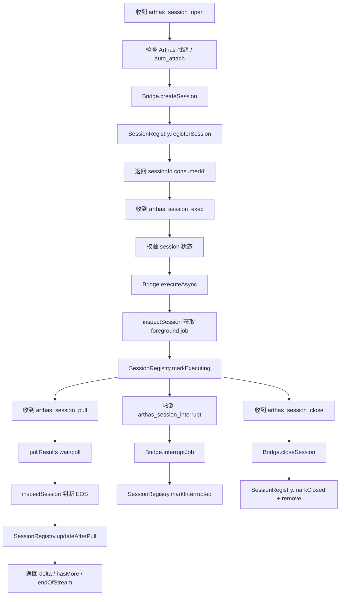

## Arthas Phase 4：Agent 异步 Session 能力实施记录

## 1. 需求背景

本阶段目标是在 Agent 侧补齐 Arthas 异步 Session 能力，为 `watch`、`trace`、`stack` 等长任务和持续输出类命令提供可复用的 session 化执行基础。

本轮新增修复背景：运行时探针显示 `arthas_session_open` 在真实任务链路上存在“任务进入 `TaskDispatcher.runningTasks` 但未正常收尾”的现象。上一轮先修复了 Arthas 异步 session 执行器默认使用 `CompletableFuture.supplyAsync(...)` 时落入 `ForkJoinPool.commonPool()` 的线程模型问题；本轮继续排查后确认，`arthas_session_open` / `arthas_session_exec` 还错误继承了“默认必须 tunnel ready”的就绪语义，导致在本地 Arthas 已可执行但 tunnel 尚未 terminal ready 时，任务会被前置拦截并直接失败上报，进而表现为 `sessionRegistry` 不增长。

约束如下：

- 继续复用当前 Control Plane 任务链路
- 继续复用 `ArthasStructuredCommandBridge`
- Agent 侧负责本地 session 生命周期、TTL / idle timeout 与任务状态
- 不新增新的物理通道
- 实施过程中保留进展记录、未完成事项和遗留问题

## 2. 本阶段实施范围

- 扩展 `ArthasStructuredCommandBridge` 的异步能力：
  - `createSession()`
  - `executeAsync()`
  - `pullResults()`
  - `interruptJob()`
  - `closeSession()`
  - `inspectSession()`
- 新增异步结果模型与 session 状态模型
- 新增 `ArthasSessionRegistry`
- 新增以下执行器：
  - `arthas_session_open`
  - `arthas_session_exec`
  - `arthas_session_pull`
  - `arthas_session_interrupt`
  - `arthas_session_close`
- 在 `ArthasIntegration` 注册异步 session 执行器与过期清理任务
- 补充 Phase 4 核心单元测试
- 本轮修复 Agent 任务执行线程模型：将 `TaskDispatcher` 的受控线程池透传给 Arthas 异步 session 执行器族，避免回退到 `ForkJoinPool.commonPool()`
- 实施完成后执行模块编译检查

## 3. 实施流程图

## 4. 当前实施进度

- **状态**：已完成本轮代码实施、线程模型修复与模块编译校验；运行时根因仍需继续联调验证
- **已完成**：
  - 新增 `ArthasSessionState`
  - 新增 `ArthasAsyncSessionSnapshot`
  - 新增 `StructuredAsyncResult`
  - 新增 `ArthasSessionInspection`
  - 新增 `ArthasSessionRegistry`
  - 扩展 `ArthasStructuredCommandBridge` 的异步 session 反射能力
  - 新增 `ArthasAsyncExecutorSupport`
  - 新增 `ArthasSessionOpenExecutor`
  - 新增 `ArthasSessionExecExecutor`
  - 新增 `ArthasSessionPullExecutor`
  - 新增 `ArthasSessionInterruptExecutor`
  - 新增 `ArthasSessionCloseExecutor`
  - 在 `ArthasIntegration` 中注册异步 session 执行器与 session cleanup 定时任务
  - 修复 `Error Prone` / `-Werror` 约束下的 DTO builder、静态方法、布尔参数注释和未使用导入问题
  - 新增 `ArthasSessionRegistryTest`
  - 扩展 `ArthasStructuredCommandBridgeTest`，补充 async 错误分类与 timeout 映射测试
  - 完成 Phase 4 核心定向测试校验
  - 完成 `:sdk-extensions:controlplane:compileJava` 编译校验
  - 本轮将 `TaskDispatcher` 的 `taskExecutor` 透传到 `TaskExecutionContext`
  - 本轮在 `ArthasAsyncExecutorSupport` 中新增统一 `executeAsync(...)` 入口
  - 本轮将 `ArthasSessionOpenExecutor`、`ArthasSessionExecExecutor`、`ArthasSessionPullExecutor`、`ArthasSessionInterruptExecutor`、`ArthasSessionCloseExecutor` 全部改为优先使用 dispatcher 受控线程池执行
  - 本轮修正 `arthas_session_open` / `arthas_session_exec` 的缺省 `require_tunnel_ready` 语义，改为默认按本地 Arthas ready 执行
  - 本轮扩展 `ArthasStructuredCommandBridgeTest`，补充 session 任务默认就绪语义常量校验
  - 完成本轮 `./gradlew :sdk-extensions:controlplane:compileTestJava :sdk-extensions:controlplane:compileJava` 编译校验

- **未完成**：
  - 更完整的执行器层单元测试
  - `watch` / `trace` / `stack` 的真实联调验证
  - 缓冲上限、并发竞态和更细粒度的 metrics 补强
  - 验证本轮线程模型修复是否彻底解决 `arthas_session_open` 的运行中挂起问题

## 5. 待办清单

- [x] 扩展桥接层异步方法
- [x] 新建 session 状态 / 快照 / 异步结果模型
- [x] 实现 `ArthasSessionRegistry`
- [x] 新增 5 个异步 session 执行器
- [x] 在 `ArthasIntegration` 注册异步执行器和 cleanup 调度
- [x] 执行本轮编译检查并记录结果
- [x] 根据编译结果修正 Phase 4 代码
- [x] 补充核心单元测试
- [x] 修复 Arthas 异步 session 执行器默认落入 `ForkJoinPool.commonPool()` 的线程模型问题
- [x] 将 dispatcher 受控线程池透传到 `TaskExecutionContext`
- [x] 修正 `arthas_session_open` / `arthas_session_exec` 的默认 `require_tunnel_ready` 语义
- [x] 回填本轮修复记录

- [ ] 补充执行器层结果 envelope 测试
- [ ] 回填真实 `watch` / `trace` / `stack` 联调结果
- [ ] 补充 metrics / buffer limit / 并发竞态治理
- [ ] 继续运行时验证 `arthas_session_open` 是否不再卡在 `runningTasks`

## 6. 验证记录

- **定向测试命令**：`./gradlew :sdk-extensions:controlplane:test --tests "io.opentelemetry.sdk.extension.controlplane.arthas.ArthasSessionRegistryTest" --tests "io.opentelemetry.sdk.extension.controlplane.arthas.ArthasStructuredCommandBridgeTest"`
- **定向测试结果**：`BUILD SUCCESSFUL`
- **编译命令**：`./gradlew :sdk-extensions:controlplane:compileJava`
- **编译结果**：`BUILD SUCCESSFUL`
- **说明**：本轮已验证 Phase 4 的核心 registry 生命周期测试、bridge async 分类测试，以及 `controlplane` 模块编译可通过
- **本轮修复编译命令**：`./gradlew :sdk-extensions:controlplane:compileTestJava :sdk-extensions:controlplane:compileJava`
- **本轮修复编译结果**：`BUILD SUCCESSFUL`
- **本轮修复说明**：已验证 dispatcher 线程池透传与 Arthas async session 执行器统一执行入口在当前模块下可通过编译

## 7. 当前已知风险

- 当前 `pullResults()` 的 Arthas 原始返回结构需要继续用真实命令验证
- `pull` 空轮询时的 `wait_timeout_ms` 与 `endOfStream` 语义仍需联调确认
- 当前实现尚未引入独立的有界缓冲区，Phase 4 先复用 Arthas pull 结果语义
- `interrupt` 与 `pull` 并发下的最终状态一致性仍需补测
- `closeSession()` 成功但本地 registry 清理失败时需要继续观察幂等性
- 执行器层 envelope、delta 裁剪和空轮询语义还未补全单测
- 本轮虽然修复了 async session 执行器默认使用 `ForkJoinPool.commonPool()` 的问题，但仍需确认是否还有其他任务执行器存在相同线程模型隐患
- 当前运行时证据表明 `arthas_session_open` 曾出现 `runningTasks` 未清理、`sessionRegistry` 未增长的现象，修复后仍需继续实机探针验证

## 8. 本轮落地内容

- `ArthasStructuredCommandBridge` 已支持：
  - `openSession()`
  - `executeAsync()`
  - `pullResults()`
  - `interruptJob()`
  - `closeSession()`
  - `inspectSession()`
- `ArthasSessionRegistry` 负责：
  - 本地 session 注册
  - `OPEN / EXECUTING / IDLE / INTERRUPTED / CLOSED / EXPIRED / FAILED` 状态维护
  - `ttl_ms` / `idle_timeout_ms` 过期校验与 cleanup
  - 当前命令、jobId、jobStatus、`endOfStream` 快照输出
- `ArthasAsyncExecutorSupport` 负责：
  - 统一 readiness / auto_attach 判定
  - 统一 envelope 构建
  - 统一 timeout / failure 映射
  - `delta.items` 裁剪与返回结构构建
  - 本轮新增统一 `executeAsync(...)`，优先使用 `TaskExecutionContext.taskExecutor`
- `TaskExecutionContext` 本轮新增：
  - `taskExecutor` 字段
  - 对应 getter 与 builder 透传能力
- `TaskDispatcher` 本轮新增：
  - 在构建执行上下文时显式注入 dispatcher 自己管理的 `taskExecutor`
- `ArthasIntegration` 已接入：
  - 异步 session 执行器注册
  - 定时 session cleanup 调度
  - `sessionRegistry` / `scheduler` 访问入口
- 本轮新增测试覆盖：
  - `ArthasSessionRegistry` 的注册、状态流转、关闭/失败、TTL 与 idle timeout、cleanup
  - `ArthasStructuredCommandBridge` 的 async 错误分类与 invoke timeout 错误码映射
- 本轮修复覆盖执行器：
  - `ArthasSessionOpenExecutor`
  - `ArthasSessionExecExecutor`
  - `ArthasSessionPullExecutor`
  - `ArthasSessionInterruptExecutor`
  - `ArthasSessionCloseExecutor`

## 9. 遗留问题

- 执行器层结果 envelope 与 `delta.items` 裁剪语义尚未补齐测试
- 真实 `watch` / `trace` / `stack` 输出增量的 `delta.items` 裁剪语义尚未联调确认
- 结果过大时当前仅有执行器侧裁剪，尚未形成完整的限流 / metrics / 监控闭环
- `pull` 空轮询成功但无结果时，Collector 侧期望的 envelope 语义还需在 Phase 5 / Phase 6 联调阶段进一步确认
- 本轮线程模型修复目前已通过编译校验，但仍需要继续运行时验证 `arthas_session_open` / `arthas_session_exec` 等任务在真实 Agent 上的完成与上报链路
