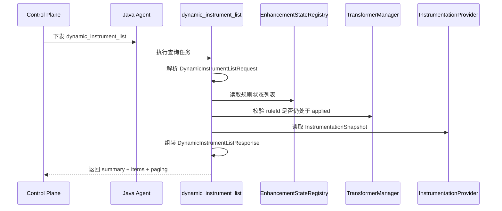

## 动态增强规则列表任务实施记录

### 需求背景

当前探针端仅支持 `dynamic_instrument` 与 `dynamic_uninstrument` 两类任务，控制面无法主动查询探针内已下发规则列表以及每条规则的当前生效状态。

为支撑工作台侧“查看已下发规则列表与生效状态”的能力，本次在探针端新增只读任务类型 `dynamic_instrument_list`，用于返回 JVM 运行时视角的动态增强规则快照。

### 目标范围

- 新增探针任务类型：`dynamic_instrument_list`
- 返回当前探针内已知规则列表、生命周期状态、当前是否真实生效
- 返回 Instrumentation 可用性与增强能力摘要
- 将新任务注册到 `DynamicInstrumentationIntegration`，使其自动参与任务能力上报
- 将任务请求/响应 DTO 归档到 `instrument/dto` 目录下统一管理

### 设计摘要

- **状态来源**：`EnhancementStateRegistry`
- **生效判定**：`TransformerManager.isApplied(ruleId)` 与状态 `ACTIVE` 共同决定
- **能力来源**：`InstrumentationProvider.getSnapshot()`
- **入参对象**：`io.opentelemetry.sdk.extension.controlplane.instrument.dto.DynamicInstrumentListRequest`
- **出参对象**：`io.opentelemetry.sdk.extension.controlplane.instrument.dto.DynamicInstrumentListResponse`
- **DTO 目录**：`sdk-extensions/controlplane/src/main/java/io/opentelemetry/sdk/extension/controlplane/instrument/dto/`
- **返回结构**：`summary + items + paging`
- **支持过滤**：`rule_id`、`class_name`、`method_name`、`type`、`status`、`active_only`
- **支持附加选项**：`include_config`、`limit`、`offset`

### 探针侧处理流程



### 入参说明

| 参数名 | 类型 | 必填 | 默认值 | 说明 |
| --- | --- | --- | --- | --- |
| `rule_id` | `String` | 否 | 空字符串 | 按规则 ID 精确过滤 |
| `class_name` | `String` | 否 | 空字符串 | 按目标类全限定名精确过滤 |
| `method_name` | `String` | 否 | 空字符串 | 按目标方法名精确过滤 |
| `type` | `String` | 否 | 空 | 增强类型过滤，支持 `trace`、`metric`、`log` |
| `status` | `String` | 否 | 空 | 生命周期状态过滤，支持 `pending`、`active`、`reverting`、`reverted`、`failed` |
| `active_only` | `boolean` | 否 | `false` | 是否仅返回当前真实生效的规则 |
| `include_config` | `boolean` | 否 | `false` | 是否在结果项中附带规则配置 `config` |
| `limit` | `int` | 否 | `100` | 分页大小，范围 `1-500` |
| `offset` | `int` | 否 | `0` | 分页起始偏移量，必须大于等于 `0` |

### 出参说明

- **`summary`**：整体汇总信息，由 `DynamicInstrumentListResponse.Summary` 管理
  - `registered_total`：注册表中的规则总数
  - `total`：当前过滤条件下命中的规则数
  - `pending/active/reverting/reverted/failed`：按生命周期状态聚合的数量
  - `effective`：当前真实生效的规则数
  - `active_transformer_count`：当前处于激活状态的 transformer 数
  - `instrumentation_available`：当前 JVM 是否可访问 `Instrumentation`
  - `enhancement_capability`：当前 JVM 是否具备增强能力
  - `supports_retransform` / `supports_redefine`：JVM 增强能力细项
  - `instrumentation_source`：Instrumentation 来源
  - `diagnostic_message`：诊断信息

- **`items`**：规则明细列表，由 `DynamicInstrumentListResponse.Item` 管理
  - `rule_id`、`class_name`、`method_name`、`method_descriptor`、`parameter_types`
  - `type`、`span_name`
  - `status`、`runtime_status`
  - `is_applied`、`is_effective`
  - `created_at_millis`、`activated_at_millis`、`reverted_at_millis`
  - `error_message`、`enhanced_class_name`
  - `config`：仅在 `include_config=true` 时返回

- **`paging`**：分页信息，由 `DynamicInstrumentListResponse.Paging` 管理
  - `offset`
  - `limit`
  - `returned`
  - `has_more`

### 实施进展

- [x] 明确任务类型、查询参数与返回结构
- [x] 设计基于 `EnhancementStateRegistry` + `TransformerManager` 的运行时快照查询方案
- [x] 新增 `DynamicInstrumentListExecutor`
- [x] 在 `DynamicInstrumentationIntegration` 中注册新任务执行器
- [x] 执行 `:sdk-extensions:controlplane:compileJava` 编译校验
- [x] 补充入参说明文档
- [x] 将入参和出参改为 Java 对象统一管理
- [x] 将请求/响应 DTO 归档到 `instrument/dto` 目录并完成跨包可见性调整

### 实际实现结果

- 已新增 `dynamic_instrument_list` 任务执行器，支持按 `rule_id`、`class_name`、`method_name`、`type`、`status`、`active_only` 过滤
- 入参已由 `DynamicInstrumentListRequest` 统一管理，封装参数解析、默认值和校验逻辑
- 出参已由 `DynamicInstrumentListResponse` 统一管理，封装 `summary`、`items`、`paging` 结构与 JSON 序列化逻辑
- 请求/响应 DTO 已归档到 `instrument/dto` 目录，并通过 `public` API 暴露给执行器使用
- `summary` 中已包含 `instrumentation_available`、`enhancement_capability`、`active_transformer_count` 等运行时能力摘要
- `items` 中已包含规则标识、目标方法、生命周期状态、时间戳、错误信息以及 `is_effective`

### 返回结果约定

```json
{
  "summary": {
    "registered_total": 3,
    "total": 2,
    "active": 1,
    "failed": 1,
    "effective": 1,
    "active_transformer_count": 1,
    "instrumentation_available": true,
    "enhancement_capability": true
  },
  "items": [
    {
      "rule_id": "UserService.handleLogin_trace",
      "class_name": "com.example.UserService",
      "method_name": "handleLogin",
      "type": "trace",
      "status": "active",
      "is_effective": true
    }
  ],
  "paging": {
    "offset": 0,
    "limit": 100,
    "returned": 1,
    "has_more": false
  }
}
```

### 遗留事项

- 控制面与工作台仍需消费 `dynamic_instrument_list` 结果，并与规则中心进行聚合展示
- 当前结果反映的是**当前 JVM 生命周期内**的运行时快照，不覆盖跨重启历史审计
