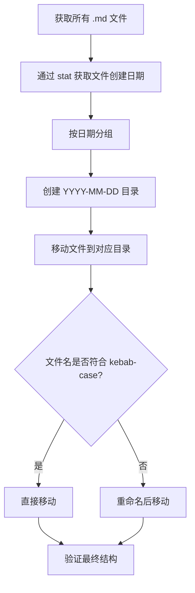

# docs 目录文档整理

## 背景

`docs/` 目录下的 11 个 `.md` 文件直接放在根目录，违反了 `.doc-rules.md` 中"按日期归类"的规范。需要将所有文档按首次创建日期移入对应的 `YYYY-MM-DD` 子目录中。

## 需求 / 目标

1. 将所有散落在 `docs/` 根目录的 `.md` 文件按创建日期归入对应的 `YYYY-MM-DD` 目录
2. 修正不符合 kebab-case 命名规范的文件名
3. 确保 `.doc-rules.md` 保留在根目录不动

## 方案设计



## 实施进展

- [x] 获取所有文件的创建日期（Birth time）
- [x] 创建 8 个日期目录：`2026-01-06`、`2026-02-12`、`2026-03-09`、`2026-03-11`、`2026-03-30`、`2026-03-31`、`2026-04-01`、`2026-04-13`
- [x] 移动 11 个文件到对应目录
- [x] 重命名 `ARTHAS_STATE_AND_TASK_MANAGEMENT.md` → `arthas-state-and-task-management.md`（kebab-case）
- [x] 验证最终目录结构正确

## 文件移动清单

| 原文件名 | 创建日期 | 目标路径 | 备注 |
|---------|---------|---------|------|
| `ARTHAS_STATE_AND_TASK_MANAGEMENT.md` | 2026-01-06 | `2026-01-06/arthas-state-and-task-management.md` | 重命名为 kebab-case |
| `async-profiler-task-guide.md` | 2026-02-12 | `2026-02-12/async-profiler-task-guide.md` | - |
| `dynamic-instrumentation-test-cases.md` | 2026-03-09 | `2026-03-09/dynamic-instrumentation-test-cases.md` | - |
| `dynamic-instrumentation-changelog.md` | 2026-03-11 | `2026-03-11/dynamic-instrumentation-changelog.md` | - |
| `peer-service-auto-resolution.md` | 2026-03-30 | `2026-03-30/peer-service-auto-resolution.md` | - |
| `arthas-structured-command-bridge-design.md` | 2026-03-31 | `2026-03-31/arthas-structured-command-bridge-design.md` | - |
| `arthas-collector-agent-protocol-design.md` | 2026-03-31 | `2026-03-31/arthas-collector-agent-protocol-design.md` | - |
| `arthas-collector-agent-roadmap.md` | 2026-03-31 | `2026-03-31/arthas-collector-agent-roadmap.md` | - |
| `arthas-phase1-agent-sync-exec-mvp-implementation.md` | 2026-03-31 | `2026-03-31/arthas-phase1-agent-sync-exec-mvp-implementation.md` | - |
| `arthas-phase4-agent-async-session-implementation.md` | 2026-04-01 | `2026-04-01/arthas-phase4-agent-async-session-implementation.md` | - |
| `dynamic-instrumentation-rule-list-task-implementation.md` | 2026-04-13 | `2026-04-13/dynamic-instrumentation-rule-list-task-implementation.md` | - |

## 最终目录结构

```
docs/
├── .doc-rules.md
├── 2026-01-06/
│   └── arthas-state-and-task-management.md
├── 2026-02-12/
│   └── async-profiler-task-guide.md
├── 2026-03-09/
│   └── dynamic-instrumentation-test-cases.md
├── 2026-03-11/
│   └── dynamic-instrumentation-changelog.md
├── 2026-03-30/
│   └── peer-service-auto-resolution.md
├── 2026-03-31/
│   ├── arthas-collector-agent-protocol-design.md
│   ├── arthas-collector-agent-roadmap.md
│   ├── arthas-phase1-agent-sync-exec-mvp-implementation.md
│   └── arthas-structured-command-bridge-design.md
├── 2026-04-01/
│   └── arthas-phase4-agent-async-session-implementation.md
├── 2026-04-13/
│   └── dynamic-instrumentation-rule-list-task-implementation.md
└── 2026-04-29/
    └── docs-reorganization.md  ← 本文档
```

## 遗留问题

无。所有文档已按规范整理完毕。
