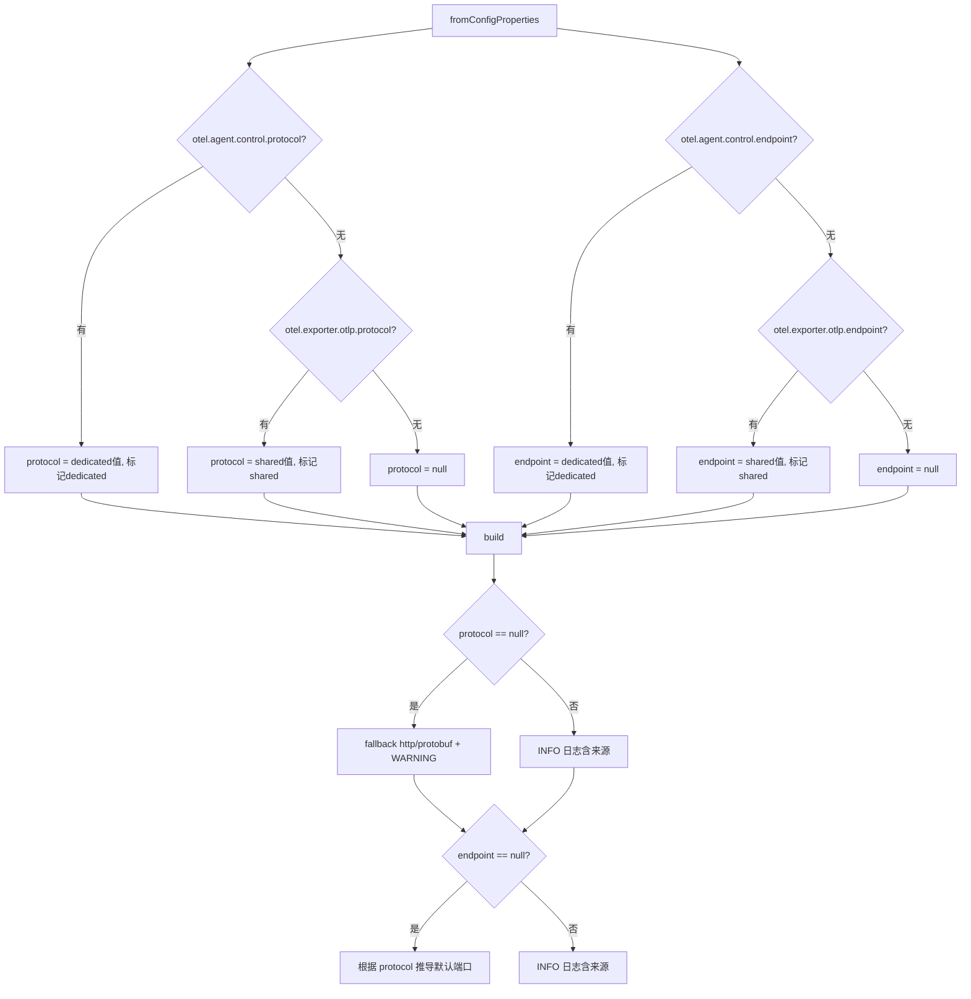

# ControlPlane 协议默认值与统一端点设计

## 背景

ControlPlane 模块原先硬编码 `DEFAULT_PROTOCOL = "grpc"`，但 javaagent 环境下通过 `OtlpProtocolPropertiesSupplier` 将 `otel.exporter.otlp.protocol` 默认值设为 `http/protobuf`。两者不一致导致：

- 用户未显式配置协议时，controlplane 使用 gRPC 连接 4317 端口
- 实际 javaagent OTLP exporter 使用 `http/protobuf`
- Collector 4317 端口若只支持 gRPC，心跳请求会收到 HTTP 415

同时，作为 javaagent extension 独立加载时，控制平面和遥测可能部署在不同服务，需要独立配置能力。

## 目标

1. ControlPlane 不再维护独立协议默认值，从 ConfigProperties 消费协议配置
2. 日志清晰体现协议解析的完整决策链路，快速定位协议相关问题
3. **统一端点设计**：配置 1 个即可工作，同时支持独立覆盖

## 方案设计

### 统一端点：优先级覆盖模式

```
最终 endpoint = otel.agent.control.endpoint > otel.exporter.otlp.endpoint > 根据协议自动推导
最终 protocol = otel.agent.control.protocol > otel.exporter.otlp.protocol > fallback "http/protobuf"
```

类似 OTEL 标准中 `otel.exporter.otlp.traces.endpoint` 覆盖 `otel.exporter.otlp.endpoint` 的约定。

### 配置键总览

| 配置键 | 说明 | 优先级 |
|--------|------|--------|
| `otel.agent.control.endpoint` | 控制平面专属 endpoint | 最高 |
| `otel.exporter.otlp.endpoint` | OTLP 共享 endpoint | 次之 |
| `otel.agent.control.protocol` | 控制平面专属协议 | 最高 |
| `otel.exporter.otlp.protocol` | OTLP 共享协议 | 次之 |
| (无配置) | 兜底 `http/protobuf` + 根据协议推导端口 | 最低 |

### 使用场景

**场景 A：统一部署（一个配置搞定，最常见）**
```bash
java -javaagent:opentelemetry-javaagent.jar \
     -Dotel.javaagent.extensions=/path/to/controlplane-extension.jar \
     -Dotel.exporter.otlp.endpoint=http://collector:4318 \
     -jar myapp.jar
# 遥测 → collector:4318, 控制平面 → collector:4318/v1/control
```

**场景 B：分离部署（加一个配置即可）**
```bash
java -javaagent:opentelemetry-javaagent.jar \
     -Dotel.javaagent.extensions=/path/to/controlplane-extension.jar \
     -Dotel.exporter.otlp.endpoint=http://collector:4318 \
     -Dotel.agent.control.endpoint=http://control-server:8080 \
     -jar myapp.jar
# 遥测 → collector:4318, 控制平面 → control-server:8080/v1/control
```

**场景 C：协议不同**
```bash
java -javaagent:opentelemetry-javaagent.jar \
     -Dotel.javaagent.extensions=/path/to/controlplane-extension.jar \
     -Dotel.exporter.otlp.protocol=grpc \
     -Dotel.agent.control.protocol=http/protobuf \
     -Dotel.agent.control.endpoint=http://control-server:4318 \
     -jar myapp.jar
```

### 协议解析流程



### 日志输出示例

**统一部署（共享配置）：**
```
INFO [CONTROL-PLANE] [PROTOCOL_RESOLVED] protocol=http/protobuf, source=otel.exporter.otlp.protocol (shared)
INFO [CONTROL-PLANE] [ENDPOINT_RESOLVED] endpoint=http://collector:4318, protocol=http/protobuf, source=otel.exporter.otlp.endpoint (shared)
```

**分离部署（专属覆盖）：**
```
INFO [CONTROL-PLANE] [PROTOCOL_RESOLVED] protocol=http/protobuf, source=otel.agent.control.protocol (dedicated)
INFO [CONTROL-PLANE] [ENDPOINT_RESOLVED] endpoint=http://control-server:8080, protocol=http/protobuf, source=otel.agent.control.endpoint (dedicated)
```

**无配置（fallback）：**
```
WARNING [CONTROL-PLANE] [PROTOCOL_RESOLVED] protocol=http/protobuf, source=fallback (neither otel.agent.control.protocol nor otel.exporter.otlp.protocol found). Set otel.agent.control.protocol or otel.exporter.otlp.protocol explicitly.
INFO [CONTROL-PLANE] [ENDPOINT_RESOLVED] endpoint=http://localhost:4318, protocol=http/protobuf, source=default (derived from protocol)
```

## 实施进展

- [x] 移除硬编码 `DEFAULT_PROTOCOL`，改为 `FALLBACK_PROTOCOL = "http/protobuf"`
- [x] Builder 的 protocol/endpoint 字段改为 `@Nullable`
- [x] 新增 `otel.agent.control.endpoint` 和 `otel.agent.control.protocol` 配置键
- [x] `fromConfigProperties()` 实现优先级逻辑：dedicated > shared > fallback
- [x] `build()` 日志体现来源（dedicated/shared/fallback）
- [x] fallback 场景使用 WARNING 级别，附带排查提示
- [x] `ControlPlaneLogger.logServiceInitialized()` 增加 `protocol` 字段
- [x] `DefaultControlPlaneService` 传入 protocol 参数
- [x] 新增统一端点覆盖测试用例（5 个场景）
- [x] 所有测试通过

### 改动文件

| 文件 | 改动 |
|------|------|
| `ControlPlaneConfig.java` | 新增 2 个配置键 + 优先级解析逻辑 + 来源标记 + 增强日志 |
| `ControlPlaneLogger.java` | `logServiceInitialized` 增加 protocol 参数 |
| `DefaultControlPlaneService.java` | 传入 protocol |
| `ControlPlaneConfigTest.java` | 新增 5 个统一端点覆盖场景测试 |

### 兼容性

| 变更 | 向后兼容 | 说明 |
|------|---------|------|
| 新增 `otel.agent.control.endpoint` | ✅ | 纯增量，不配置时行为不变 |
| 新增 `otel.agent.control.protocol` | ✅ | 纯增量，不配置时行为不变 |
| 日志格式变更 | ✅ | 更详细的 source 信息，不影响功能 |

## 遗留问题

- 无
