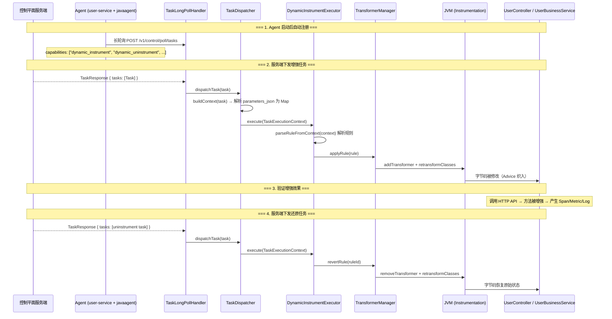

# 动态增强（Dynamic Instrumentation）测试用例文档

> **目的**：供手动测试验证动态增强/还原功能的正确性  
> **前提**：`user-service` 通过 `-javaagent:opentelemetry-javaagent.jar` 启动，controlplane 模块已集成

---

## 一、任务下发链路全景



---

## 二、核心协议格式

### 2.1 增强任务（`dynamic_instrument`）

```json
{
  "task_id": "task-xxx-001",
  "task_type_name": "dynamic_instrument",
  "parameters_json": "{\"rule_id\":\"xxx\",\"class_name\":\"全限定类名\",\"method_name\":\"方法名\",\"type\":\"trace|metric|log\",\"span_name\":\"可选-自定义Span名\"}",
  "priority_num": 50,
  "timeout_millis": 30000,
  "created_at_millis": 1741512000000,
  "expires_at_millis": 1741515600000
}
```

### 2.2 还原任务（`dynamic_uninstrument`）

```json
{
  "task_id": "task-xxx-002",
  "task_type_name": "dynamic_uninstrument",
  "parameters_json": "{\"rule_id\":\"要还原的规则ID\"}",
  "priority_num": 80,
  "timeout_millis": 15000
}
```

### 2.3 `parameters_json` 字段说明

| 参数 | 必填 | 说明 |
|------|------|------|
| `rule_id` | ✅ | 规则 ID（全局唯一） |
| `class_name` | ✅ | 目标类全限定名 |
| `method_name` | ✅ | 目标方法名 |
| `type` | ✅ | 增强类型：`trace` / `metric` / `log` |
| `parameter_types` | ❌ | **Java 风格参数类型列表**（逗号分隔），用于匹配重载方法。支持简单类名（如 `String`）和全限定名（如 `java.lang.String`）。空字符串 `""` 匹配无参方法，不传则匹配所有同名方法 |
| `method_descriptor` | ❌ | JVM 方法描述符（高级，优先级高于 `parameter_types`），如 `(Ljava/lang/String;I)V` |
| `span_name` | ❌ | 自定义 Span 名称，仅 TRACE 类型有效 |
| `config.force` | ❌ | 是否强制增强（忽略冲突检测） |
| `config.capture_args` | ❌ | 要采集的方法参数。支持三种指定方式：按索引（`"0,2"`）、按参数名（`"userId,requestType"`）、全部参数（`"*"`）。按参数名需要目标类以 `-parameters` 编译。仅 TRACE 类型有效 |
| `config.capture_return` | ❌ | 采集方法返回值。`"*"` 采集 toString()；`"id,name"` 仅提取指定字段（不采集 toString()）；不传或 `"false"` 不采集。仅 TRACE 类型有效 |
| `config.capture_max_length` | ❌ | 值序列化最大字符数，超过则截断。默认 `256` |

---

## 三、OTel Agent 默认增强与动态增强冲突分析

### 3.1 user-service 中方法分类

#### 🔴 会被 Agent 默认增强的方法（高冲突风险 — 避免动态 TRACE 增强）

| 类 | 方法 | Agent 增强原因 | 生成的 Span |
|----|------|-------------|------------|
| `UserController` | `getUser(@PathVariable)` | `@GetMapping("/{id}")` | `GET /user/{id}` |
| `UserController` | `getAllUsers()` | `@GetMapping` | `GET /user` |
| `UserController` | `addUser(@RequestBody)` | `@PostMapping` | `POST /user` |
| `UserController` | `updateUser(...)` | `@PutMapping("/{id}")` | `PUT /user/{id}` |
| `UserController` | `deleteUser(@PathVariable)` | `@DeleteMapping("/{id}")` | `DELETE /user/{id}` |
| `UserController` | `health()` | `@GetMapping("/health")` | `GET /user/health` |
| `UserController` | `mockBatched()` | `@GetMapping("/mockBatched")` | `GET /user/mockBatched` |
| `OrderConsumerService` | Kafka 消费监听 | Kafka Consumer 增强 | `order-topic receive` |

#### 🟢 不被 Agent 默认增强的方法（安全 — 适合动态增强测试）

| 类 | 方法 | 原因 |
|----|------|------|
| `UserBusinessService` | `handleUserRegistration()` | 普通 `@Service` Bean，无框架注解 |
| `UserBusinessService` | `handleOrderStatusChange()` | 同上 |
| `UserBusinessService` | `handleUserLogin()` | 同上 |
| `UserBusinessService` | `handleUserLogout()` | 同上 |
| `UserBusinessService` | `checkNotificationServiceHealth()` | 同上 |
| `UserBusinessService` | `getNotificationServiceStatus()` | 同上 |
| `UserBusinessService` | `handleSystemMaintenanceNotification()` | 同上 |
| `UserInfoService` | `mockBatched()` | Service 层方法（注意：Controller 的同名方法会被增强，Service 层不会） |

### 3.2 已实施的防护机制

**Step 1（基础防护）已实施**：在 `TransformerManager.doApplyRule()` 中新增了 `targetMethodToRuleId` 映射表，防止不同 ruleId 增强同一 class+method。若检测到重复目标，返回错误码 `DUPLICATE_TARGET`。

---

## 四、测试用例汇总矩阵

### 4.1 正常场景

| # | 用例名称 | task_type_name | 目标类 | 目标方法 | type | 与 Agent 冲突 | 验证重点 | 预期 |
|---|---------|---------------|--------|---------|------|-------------|---------|------|
| TC-01 | 安全 TRACE 增强 | `dynamic_instrument` | `UserBusinessService` | `handleUserLogin` | trace | ❌ 无 | Span 创建、属性、父子关系 | ✅ active |
| TC-02 | 安全 METRIC 增强 | `dynamic_instrument` | `UserBusinessService` | `checkNotificationServiceHealth` | metric | ❌ 无 | duration 直方图、invocations 计数器 | ✅ active |
| TC-03 | 安全 LOG 增强 | `dynamic_instrument` | `UserBusinessService` | `handleUserRegistration` | log | ❌ 无 | ENTER/EXIT 日志、耗时 | ✅ active |
| TC-04 | 完整生命周期（增强→还原） | `dynamic_instrument` + `dynamic_uninstrument` | `UserBusinessService` | `handleUserLogin` | trace | ❌ 无 | 增强→调用→还原→再调用 | ✅→✅ reverted |
| TC-05 | 多方法多类型混合增强 | `dynamic_instrument` ×3 | `UserBusinessService` | 3 个方法 | trace+metric+log | ❌ 无 | 三种效果同时生效+全部还原 | ✅ all active |
| TC-06 | Service 层方法增强 | `dynamic_instrument` | `UserInfoService` | `mockBatched` | trace | ❌ 无 | Span 层级（Controller→Service→Redis/JDBC） | ✅ active |
| TC-07 | 异常场景方法增强 | `dynamic_instrument` | `UserBusinessService` | `checkNotificationServiceHealth` | trace | ❌ 无 | 异常被 catch 时 Span 状态 | ✅ active |

### 4.2 参数/返回值采集场景

| # | 用例名称 | task_type_name | 目标类 | 目标方法 | 采集配置 | 验证重点 | 预期 |
|---|---------|---------------|--------|---------|---------|---------|------|
| TC-14 | 按索引采集参数 | `dynamic_instrument` | `UserController` | `getUser` | `capture_args: "0"` | Span 包含 `code.function.args.0` | ✅ active |
| TC-15 | 按参数名采集参数 | `dynamic_instrument` | `UserController` | `getUser` | `capture_args: "id"` | Span 包含 `code.function.args.id` | ✅ active |
| TC-16 | 全部参数采集 | `dynamic_instrument` | `UserController` | `updateUser` | `capture_args: "*"` | 所有参数都出现在 Span Attribute | ✅ active |
| TC-17 | 仅返回值采集 | `dynamic_instrument` | `UserBusinessService` | `handleUserLogin` | `capture_return: "*"` | Span 包含 `code.function.return` | ✅ active |
| TC-18 | 返回值字段提取 | `dynamic_instrument` | `UserInfoService` | `getById` | `capture_return: "id,name"` | Span 包含 `code.function.return.id` 和 `.name`（不含 `code.function.return`） | ✅ active |
| TC-19 | 参数+返回值组合采集 | `dynamic_instrument` | `UserController` | `getUser` | `capture_args: "0"`, `capture_return: "*"` | 参数和返回值都出现在 Span Attribute | ✅ active |
| TC-20 | 值截断（max_length） | `dynamic_instrument` | `UserBusinessService` | `handleUserLogin` | `capture_args: "*"`, `capture_max_length: "10"` | 超长值被截断并附加 `...(truncated)` | ✅ active |
| TC-21 | 异常时参数采集不丢失 | `dynamic_instrument` | `UserBusinessService` | `checkNotificationServiceHealth` | `capture_args: "*"`, `capture_return: "*"` | 异常时参数 Attribute 仍存在，return 为空 | ✅ active |
| TC-22 | 无采集配置走轻量 Advice | `dynamic_instrument` | `UserBusinessService` | `handleUserLogin` | 无 `capture_*` | 使用 `DynamicByteBuddyAdvice`（无 @AllArguments 开销） | ✅ active |

### 4.3 异常场景

| # | 用例名称 | task_type_name | 异常类型 | 验证重点 | 预期错误码 |
|---|---------|---------------|---------|---------|----------|
| TC-08 | 不存在的类 | `dynamic_instrument` | 类找不到 | 返回明确错误信息 | `CLASS_NOT_FOUND` |
| TC-09 | 重复 ruleId | `dynamic_instrument` | 规则已存在 | 返回 ruleId 重复错误 | `ALREADY_APPLIED` |
| TC-10 | 重复目标方法（不同 ruleId） | `dynamic_instrument` | 同一 class+method 被不同规则增强 | 返回目标重复错误 | `DUPLICATE_TARGET` |
| TC-11 | 无效增强类型 | `dynamic_instrument` | 不支持的 type | 返回参数错误 | `INVALID_PARAMETERS` |
| TC-12 | 还原不存在的规则 | `dynamic_uninstrument` | 规则未找到 | 返回明确错误 | `RULE_NOT_FOUND` |
| TC-13 | 重载方法精确匹配（parameter_types） | `dynamic_instrument` | 正常增强 | 仅匹配指定参数类型的方法 | ✅ active |

---

## 五、测试用例详情

### TC-01：安全 TRACE 增强 — `UserBusinessService.handleUserLogin()`

**为什么选这个方法**：普通业务 Service，不带 Spring MVC / gRPC / Kafka 注解，OTel Agent 不会对它进行静态增强。

**下发增强任务：**
```json
{
  "task_id": "test-safe-trace-001",
  "task_type_name": "dynamic_instrument",
  "parameters_json": "{\"rule_id\":\"rule-safe-trace-login\",\"class_name\":\"com.tencent.cloudmonitor.userservice.domain.service.UserBusinessService\",\"method_name\":\"handleUserLogin\",\"type\":\"trace\",\"span_name\":\"UserBusinessService.handleUserLogin\"}"
}
```

**验证步骤：**

| 步骤 | 操作 | 预期结果 |
|------|------|---------|
| 1 | 下发上述增强任务 | Agent 日志输出 `[TRANSFORMER-MANAGER] Applied rule: rule-safe-trace-login` |
| 2 | 触发 `handleUserLogin` 调用 | 方法正常执行 |
| 3 | 检查 Jaeger/Trace 后端 | 应看到名为 `UserBusinessService.handleUserLogin` 的 Span |
| 4 | 检查 Span 属性 | `code.namespace=...UserBusinessService`、`code.function=handleUserLogin`、`dynamic.instrumentation.rule_id=rule-safe-trace-login` |
| 5 | 检查 Span 父子关系 | 如果从 HTTP 请求触发，该 Span 应是 HTTP 入口 Span 的子 Span |

---

### TC-02：安全 METRIC 增强 — `UserBusinessService.checkNotificationServiceHealth()`

**下发增强任务：**
```json
{
  "task_id": "test-safe-metric-001",
  "task_type_name": "dynamic_instrument",
  "parameters_json": "{\"rule_id\":\"rule-safe-metric-health\",\"class_name\":\"com.tencent.cloudmonitor.userservice.domain.service.UserBusinessService\",\"method_name\":\"checkNotificationServiceHealth\",\"type\":\"metric\"}"
}
```

**验证步骤：**

| 步骤 | 操作 | 预期结果 |
|------|------|---------|
| 1 | 下发增强任务 | 成功 |
| 2 | 多次触发 `checkNotificationServiceHealth`（如 5 次） | 方法正常返回 |
| 3 | 检查 Metric 后端 | `dynamic.method.duration{code.function="checkNotificationServiceHealth"}` 直方图有 5 个数据点 |
| 4 | 检查计数器 | `dynamic.method.invocations{code.function="checkNotificationServiceHealth"}` 值为 5 |
| 5 | 验证异常标记 | 如果 NotificationService 不可用，`error="true"` 指标应增加 |

---

### TC-03：安全 LOG 增强 — `UserBusinessService.handleUserRegistration()`

**下发增强任务：**
```json
{
  "task_id": "test-safe-log-001",
  "task_type_name": "dynamic_instrument",
  "parameters_json": "{\"rule_id\":\"rule-safe-log-register\",\"class_name\":\"com.tencent.cloudmonitor.userservice.domain.service.UserBusinessService\",\"method_name\":\"handleUserRegistration\",\"type\":\"log\"}"
}
```

**验证步骤：**

| 步骤 | 操作 | 预期结果 |
|------|------|---------|
| 1 | 下发增强任务 | 成功 |
| 2 | 触发用户注册调用 | 方法正常执行 |
| 3 | 检查日志 | `[DYNAMIC-LOG] ENTER UserBusinessService.handleUserRegistration [ruleId=rule-safe-log-register]` |
| 4 | 检查出口日志 | `[DYNAMIC-LOG] EXIT UserBusinessService.handleUserRegistration [ruleId=rule-safe-log-register] duration=Xms` |
| 5 | 异常场景 | `[DYNAMIC-LOG] ERROR ... exception=...` |

---

### TC-04：完整生命周期（增强 → 调用验证 → 还原 → 再调用验证）

**步骤 A — 增强：**
```json
{
  "task_id": "test-lifecycle-001",
  "task_type_name": "dynamic_instrument",
  "parameters_json": "{\"rule_id\":\"rule-lifecycle-001\",\"class_name\":\"com.tencent.cloudmonitor.userservice.domain.service.UserBusinessService\",\"method_name\":\"handleUserLogin\",\"type\":\"trace\",\"span_name\":\"UserBusinessService.handleUserLogin\"}"
}
```

**步骤 B — 还原：**
```json
{
  "task_id": "test-lifecycle-revert-001",
  "task_type_name": "dynamic_uninstrument",
  "parameters_json": "{\"rule_id\":\"rule-lifecycle-001\"}"
}
```

**验证矩阵：**

| 步骤 | 操作 | 预期结果 |
|------|------|---------|
| 1 | 下发增强任务 | `Applied rule: rule-lifecycle-001` |
| 2 | 触发 `handleUserLogin` | Trace 后端出现 `UserBusinessService.handleUserLogin` Span |
| 3 | 下发还原任务 | `Reverted rule: rule-lifecycle-001` |
| 4 | 再次触发 `handleUserLogin` | **不再**产生动态 Span |
| 5 | 验证业务功能 | 方法返回值正常，业务逻辑未受影响 |

---

### TC-05：多方法多类型混合增强

**下发 3 个增强任务：**

**任务 1 — TRACE 增强 handleUserLogin：**
```json
{
  "task_id": "test-mix-001",
  "task_type_name": "dynamic_instrument",
  "parameters_json": "{\"rule_id\":\"rule-mix-trace-login\",\"class_name\":\"com.tencent.cloudmonitor.userservice.domain.service.UserBusinessService\",\"method_name\":\"handleUserLogin\",\"type\":\"trace\"}"
}
```

**任务 2 — METRIC 增强 checkNotificationServiceHealth：**
```json
{
  "task_id": "test-mix-002",
  "task_type_name": "dynamic_instrument",
  "parameters_json": "{\"rule_id\":\"rule-mix-metric-health\",\"class_name\":\"com.tencent.cloudmonitor.userservice.domain.service.UserBusinessService\",\"method_name\":\"checkNotificationServiceHealth\",\"type\":\"metric\"}"
}
```

**任务 3 — LOG 增强 handleOrderStatusChange：**
```json
{
  "task_id": "test-mix-003",
  "task_type_name": "dynamic_instrument",
  "parameters_json": "{\"rule_id\":\"rule-mix-log-order\",\"class_name\":\"com.tencent.cloudmonitor.userservice.domain.service.UserBusinessService\",\"method_name\":\"handleOrderStatusChange\",\"type\":\"log\"}"
}
```

**验证步骤：**

| 步骤 | 操作 | 预期结果 |
|------|------|---------|
| 1 | 依次下发 3 个任务 | 全部成功，Agent 日志显示 3 条 Applied |
| 2 | 触发 `handleUserLogin` | Trace 后端出现 Span |
| 3 | 多次触发 `checkNotificationServiceHealth` | Metric 后端出现 duration + invocations |
| 4 | 触发 `handleOrderStatusChange` | 日志出现 ENTER/EXIT |
| 5 | 全部还原（依次下发 3 个 uninstrument 任务） | 所有增强效果消失 |

**还原任务：**
```json
{"task_id":"test-mix-revert-001","task_type_name":"dynamic_uninstrument","parameters_json":"{\"rule_id\":\"rule-mix-trace-login\"}"}
{"task_id":"test-mix-revert-002","task_type_name":"dynamic_uninstrument","parameters_json":"{\"rule_id\":\"rule-mix-metric-health\"}"}
{"task_id":"test-mix-revert-003","task_type_name":"dynamic_uninstrument","parameters_json":"{\"rule_id\":\"rule-mix-log-order\"}"}
```

---

### TC-06：Service 层方法增强 — `UserInfoService.mockBatched()`

**为什么安全**：`UserInfoService.mockBatched()` 方法本身不带 Spring MVC 注解，虽然内部调用 Redis/JDBC 会被 Agent 增强产生子 Span，但方法本身不被增强。

**下发增强任务：**
```json
{
  "task_id": "test-safe-svc-001",
  "task_type_name": "dynamic_instrument",
  "parameters_json": "{\"rule_id\":\"rule-safe-svc-mockBatched\",\"class_name\":\"com.tencent.cloudmonitor.userservice.domain.service.UserInfoService\",\"method_name\":\"mockBatched\",\"type\":\"trace\",\"span_name\":\"UserInfoService.mockBatched\"}"
}
```

**验证步骤：**

| 步骤 | 操作 | 预期结果 |
|------|------|---------|
| 1 | 下发增强任务 | 成功 |
| 2 | 调用 `GET /user/mockBatched` | 方法正常执行 |
| 3 | 检查 Trace 链路 | `GET /user/mockBatched`（Agent Span）→ `UserInfoService.mockBatched`（动态 Span）→ Redis/JDBC Spans（Agent 子 Span） |
| 4 | 验证层级正确 | 动态 Span 是 Controller Span 的子 Span，Redis/JDBC 是动态 Span 的子 Span |

---

### TC-07：异常场景方法增强

**前置条件**：确保 NotificationService 不可达（停止通知服务或修改配置指向错误地址）

**下发增强任务：**
```json
{
  "task_id": "test-safe-error-001",
  "task_type_name": "dynamic_instrument",
  "parameters_json": "{\"rule_id\":\"rule-safe-error-health\",\"class_name\":\"com.tencent.cloudmonitor.userservice.domain.service.UserBusinessService\",\"method_name\":\"checkNotificationServiceHealth\",\"type\":\"trace\"}"
}
```

**验证步骤：**

| 步骤 | 操作 | 预期结果 |
|------|------|---------|
| 1 | 确保 NotificationService 不可达 | — |
| 2 | 触发 `checkNotificationServiceHealth` | 方法内部 catch 异常返回 `false` |
| 3 | 检查 Span | Span 状态应为 `OK`（因为异常被 catch，方法正常返回） |
| 4 | 如果方法直接抛出异常 | Span 应标记 `status=ERROR`，记录 `exception` 事件 |

---

### TC-08：异常场景 — 不存在的类

**下发任务：**
```json
{
  "task_id": "test-err-class-001",
  "task_type_name": "dynamic_instrument",
  "parameters_json": "{\"rule_id\":\"rule-err-class-001\",\"class_name\":\"com.tencent.cloudmonitor.userservice.NonExistentClass\",\"method_name\":\"doSomething\",\"type\":\"trace\"}"
}
```

**预期结果：**
```json
{
  "error_code": "CLASS_NOT_FOUND",
  "error_message": "Target class not found: com.tencent.cloudmonitor.userservice.NonExistentClass"
}
```

---

### TC-09：异常场景 — 重复 ruleId

**前置条件**：先成功下发 `rule-safe-trace-login` 增强任务（TC-01）

**下发任务（同一 ruleId）：**
```json
{
  "task_id": "test-err-dup-rule-001",
  "task_type_name": "dynamic_instrument",
  "parameters_json": "{\"rule_id\":\"rule-safe-trace-login\",\"class_name\":\"com.tencent.cloudmonitor.userservice.domain.service.UserBusinessService\",\"method_name\":\"handleUserLogin\",\"type\":\"trace\"}"
}
```

**预期结果：**
```json
{
  "error_code": "ALREADY_APPLIED",
  "error_message": "Rule already active: rule-safe-trace-login"
}
```

---

### TC-10：异常场景 — 重复目标方法（不同 ruleId）

**前置条件**：先成功下发 TC-01 对 `handleUserLogin` 的增强

**下发任务（不同 ruleId，同一 class+method）：**
```json
{
  "task_id": "test-err-dup-target-001",
  "task_type_name": "dynamic_instrument",
  "parameters_json": "{\"rule_id\":\"rule-another-trace-login\",\"class_name\":\"com.tencent.cloudmonitor.userservice.domain.service.UserBusinessService\",\"method_name\":\"handleUserLogin\",\"type\":\"metric\"}"
}
```

**预期结果：**
```json
{
  "error_code": "DUPLICATE_TARGET",
  "error_message": "Method com.tencent.cloudmonitor.userservice.domain.service.UserBusinessService#handleUserLogin already enhanced by rule: rule-safe-trace-login"
}
```

---

### TC-11：异常场景 — 无效增强类型

**下发任务：**
```json
{
  "task_id": "test-err-type-001",
  "task_type_name": "dynamic_instrument",
  "parameters_json": "{\"rule_id\":\"rule-err-type\",\"class_name\":\"com.tencent.cloudmonitor.userservice.domain.service.UserBusinessService\",\"method_name\":\"handleUserLogin\",\"type\":\"snapshot\"}"
}
```

**预期结果：**
```json
{
  "error_code": "INVALID_PARAMETERS",
  "error_message": "Unsupported instrumentation type: snapshot, supported: [trace, metric, log]"
}
```

---

### TC-12：异常场景 — 还原不存在的规则

**下发任务：**
```json
{
  "task_id": "test-err-revert-001",
  "task_type_name": "dynamic_uninstrument",
  "parameters_json": "{\"rule_id\":\"rule-non-existent\"}"
}
```

**预期结果：**
```json
{
  "error_code": "RULE_NOT_FOUND",
  "error_message": "Rule not found: rule-non-existent"
}
```

---

### TC-13：重载方法精确匹配 — `parameter_types` 参数

**为什么需要此测试**：当目标类存在多个重载方法时，需要通过 `parameter_types` 精确指定要增强的方法。支持 Java 风格的简单类名（如 `String`、`Wrapper`），对用户更友好。

**场景 A — 无参方法精确匹配：**
```json
{
  "task_id": "test-param-types-001",
  "task_type_name": "dynamic_instrument",
  "parameters_json": "{\"rule_id\":\"rule-param-no-args\",\"class_name\":\"com.tencent.cloudmonitor.userservice.domain.service.UserInfoService\",\"method_name\":\"count\",\"type\":\"trace\",\"parameter_types\":\"\"}"
}
```

**场景 B — 单参数简单类名匹配：**
```json
{
  "task_id": "test-param-types-002",
  "task_type_name": "dynamic_instrument",
  "parameters_json": "{\"rule_id\":\"rule-param-wrapper\",\"class_name\":\"com.tencent.cloudmonitor.userservice.domain.service.UserInfoService\",\"method_name\":\"count\",\"type\":\"trace\",\"parameter_types\":\"Wrapper\"}"
}
```

**场景 C — 不指定 parameter_types（默认匹配所有重载）：**
```json
{
  "task_id": "test-param-types-003",
  "task_type_name": "dynamic_instrument",
  "parameters_json": "{\"rule_id\":\"rule-param-all\",\"class_name\":\"com.tencent.cloudmonitor.userservice.domain.service.UserInfoService\",\"method_name\":\"count\",\"type\":\"trace\"}"
}
```

**验证步骤：**

| 步骤 | 操作 | 预期结果 |
|------|------|---------|
| 1 | 下发场景 A | 仅增强无参的 `count()` 方法，不影响 `count(Wrapper)` |
| 2 | 下发场景 B | 仅增强 `count(Wrapper)` 方法，不影响无参 `count()` |
| 3 | 下发场景 C | 两个 `count` 重载都被增强 |
| 4 | 分别还原并验证 | 各场景增强效果消失，业务功能正常 |

**`parameter_types` 使用指南：**

| 用户写法 | 含义 | 示例 |
|---------|------|------|
| 不传该字段 | 匹配所有同名方法 | — |
| `""` （空字符串） | 精确匹配无参方法 | `count()` |
| `"String"` | 单参数，简单类名尾部匹配 | `foo(java.lang.String)` |
| `"String,int"` | 多参数，逗号分隔 | `foo(java.lang.String, int)` |
| `"java.lang.String"` | 全限定名精确匹配 | `foo(java.lang.String)` |
| `"Wrapper"` | 简单类名尾部匹配 | `foo(com.baomidou...Wrapper)` |

---

### TC-14：按索引采集参数 — `UserController.getUser(Long id)`

**为什么选这个方法**：`getUser` 有明确的参数（`@PathVariable Long id`），适合验证按索引采集。虽然 Controller 方法会被 Agent 增强产生 HTTP Span，但动态增强的 Span 是独立的子 Span，参数采集 Attribute 附着在动态 Span 上不冲突。

**下发增强任务：**
```json
{
  "task_id": "test-capture-idx-001",
  "task_type_name": "dynamic_instrument",
  "parameters_json": "{\"rule_id\":\"rule-capture-idx-getUser\",\"class_name\":\"com.tencent.cloudmonitor.userservice.interfaces.web.UserController\",\"method_name\":\"getUser\",\"type\":\"trace\",\"config.capture_args\":\"0\"}"
}
```

**验证步骤：**

| 步骤 | 操作 | 预期结果 |
|------|------|---------|
| 1 | 下发增强任务 | 成功，日志输出 `captureEnabled: true, adviceClass: DynamicByteBuddyCaptureAdvice` |
| 2 | 调用 `GET /user/42` | 方法正常返回 |
| 3 | 检查动态 Span Attribute | `code.function.args.0 = "42"` |
| 4 | 验证 Attribute key 格式 | key 是 `code.function.args.0`（用索引，非参数名） |

**还原任务：**
```json
{"task_id":"test-capture-idx-revert-001","task_type_name":"dynamic_uninstrument","parameters_json":"{\"rule_id\":\"rule-capture-idx-getUser\"}"}
```

---

### TC-15：按参数名采集参数 — `UserController.getUser(Long id)`

**前置条件**：目标类需以 `-parameters` 编译（大部分 Spring Boot 项目默认启用）。

**下发增强任务：**
```json
{
  "task_id": "test-capture-name-001",
  "task_type_name": "dynamic_instrument",
  "parameters_json": "{\"rule_id\":\"rule-capture-name-getUser\",\"class_name\":\"com.tencent.cloudmonitor.userservice.interfaces.web.UserController\",\"method_name\":\"getUser\",\"type\":\"trace\",\"config.capture_args\":\"id\"}"
}
```

**验证步骤：**

| 步骤 | 操作 | 预期结果 |
|------|------|---------|
| 1 | 下发增强任务 | 成功 |
| 2 | 调用 `GET /user/42` | 方法正常返回 |
| 3 | 检查动态 Span Attribute | `code.function.args.id = "42"` |
| 4 | 验证 Attribute key 格式 | key 是 `code.function.args.id`（用参数名，非索引） |
| 5 | **对比 TC-14** | TC-14 key 是 `.args.0`，TC-15 key 是 `.args.id`，值相同 |

**还原任务：**
```json
{"task_id":"test-capture-name-revert-001","task_type_name":"dynamic_uninstrument","parameters_json":"{\"rule_id\":\"rule-capture-name-getUser\"}"}
```

---

### TC-16：全部参数采集 — `UserController.updateUser(Long id, UserInfo userInfo)`

**为什么选这个方法**：`updateUser` 有 2 个参数（id + UserInfo），适合验证 `*` 通配符能否采集全部。

**下发增强任务：**
```json
{
  "task_id": "test-capture-all-001",
  "task_type_name": "dynamic_instrument",
  "parameters_json": "{\"rule_id\":\"rule-capture-all-update\",\"class_name\":\"com.tencent.cloudmonitor.userservice.interfaces.web.UserController\",\"method_name\":\"updateUser\",\"type\":\"trace\",\"config.capture_args\":\"*\"}"
}
```

**验证步骤：**

| 步骤 | 操作 | 预期结果 |
|------|------|---------|
| 1 | 下发增强任务 | 成功 |
| 2 | 调用 `PUT /user/42` 并携带 JSON body | 方法正常返回 |
| 3 | 检查动态 Span Attribute | 应包含所有参数：`code.function.args.id = "42"` 和 `code.function.args.userInfo = "UserInfo{...}"` 或 `code.function.args.0 = "42"`, `code.function.args.1 = "UserInfo{...}"` |
| 4 | 验证参数数量 | Attribute 数量应与方法参数数量一致 |

**还原任务：**
```json
{"task_id":"test-capture-all-revert-001","task_type_name":"dynamic_uninstrument","parameters_json":"{\"rule_id\":\"rule-capture-all-update\"}"}
```

---

### TC-17：仅返回值采集 — `UserBusinessService.handleUserLogin()`

**为什么选这个方法**：普通 Service 方法，无 Agent 冲突，且有返回值。

**下发增强任务：**
```json
{
  "task_id": "test-capture-ret-001",
  "task_type_name": "dynamic_instrument",
  "parameters_json": "{\"rule_id\":\"rule-capture-ret-login\",\"class_name\":\"com.tencent.cloudmonitor.userservice.domain.service.UserBusinessService\",\"method_name\":\"handleUserLogin\",\"type\":\"trace\",\"config.capture_return\":\"*\"}"
}
```

**验证步骤：**

| 步骤 | 操作 | 预期结果 |
|------|------|---------|
| 1 | 下发增强任务 | 成功 |
| 2 | 触发 `handleUserLogin` | 方法正常返回 |
| 3 | 检查 Span Attribute | `code.function.return = "<返回值的 toString() 结果>"` |
| 4 | 验证无参数 Attribute | 不应出现 `code.function.args.*` |

**还原任务：**
```json
{"task_id":"test-capture-ret-revert-001","task_type_name":"dynamic_uninstrument","parameters_json":"{\"rule_id\":\"rule-capture-ret-login\"}"}
```

---

### TC-18：返回值字段提取 — `UserInfoService.getById(Serializable id)`

**为什么选这个方法**：`getById` 返回 `UserInfo` 对象，有 `id`、`name` 等字段，适合验证 `capture_return` 字段提取功能。

**下发增强任务：**
```json
{
  "task_id": "test-capture-fields-001",
  "task_type_name": "dynamic_instrument",
  "parameters_json": "{\"rule_id\":\"rule-capture-fields-getById\",\"class_name\":\"com.tencent.cloudmonitor.userservice.domain.service.UserInfoService\",\"method_name\":\"getById\",\"type\":\"trace\",\"config.capture_return\":\"id,name\"}"
}
```

**验证步骤：**

| 步骤 | 操作 | 预期结果 |
|------|------|---------|
| 1 | 下发增强任务 | 成功 |
| 2 | 调用 `GET /user/1`（触发 `getById`） | 方法正常返回 UserInfo |
| 3 | 检查字段提取 | `code.function.return.id = "1"` |
| 4 | 检查字段提取 | `code.function.return.name = "<用户名>"` |
| 5 | 验证无 toString() | **不应**出现 `code.function.return` Attribute（指定字段时仅提取字段） |
| 6 | 返回 null（如 id 不存在） | `code.function.return.*` 不应出现（returnValue 为 null 时不采集） |

**还原任务：**
```json
{"task_id":"test-capture-fields-revert-001","task_type_name":"dynamic_uninstrument","parameters_json":"{\"rule_id\":\"rule-capture-fields-getById\"}"}
```

---

### TC-19：参数+返回值组合采集 — `UserController.getUser(Long id)`

**下发增强任务：**
```json
{
  "task_id": "test-capture-combo-001",
  "task_type_name": "dynamic_instrument",
  "parameters_json": "{\"rule_id\":\"rule-capture-combo-getUser\",\"class_name\":\"com.tencent.cloudmonitor.userservice.interfaces.web.UserController\",\"method_name\":\"getUser\",\"type\":\"trace\",\"config.capture_args\":\"0\",\"config.capture_return\":\"*\"}"
}
```

**验证步骤：**

| 步骤 | 操作 | 预期结果 |
|------|------|---------|
| 1 | 下发增强任务 | 成功 |
| 2 | 调用 `GET /user/42` | 方法正常返回 |
| 3 | 检查参数 Attribute | `code.function.args.0 = "42"` |
| 4 | 检查返回值 Attribute | `code.function.return = "<ResponseEntity 的 toString>"` |
| 5 | 验证两者共存 | 参数和返回值 Attribute 同时存在于同一个 Span 中 |

**还原任务：**
```json
{"task_id":"test-capture-combo-revert-001","task_type_name":"dynamic_uninstrument","parameters_json":"{\"rule_id\":\"rule-capture-combo-getUser\"}"}
```

---

### TC-20：值截断（capture_max_length） — `UserBusinessService.handleUserLogin()`

**验证目标**：当参数或返回值的 `toString()` 超过 `capture_max_length` 指定的长度时，应被截断并附加 `...(truncated)` 后缀。

**下发增强任务：**
```json
{
  "task_id": "test-capture-trunc-001",
  "task_type_name": "dynamic_instrument",
  "parameters_json": "{\"rule_id\":\"rule-capture-trunc-login\",\"class_name\":\"com.tencent.cloudmonitor.userservice.domain.service.UserBusinessService\",\"method_name\":\"handleUserLogin\",\"type\":\"trace\",\"config.capture_args\":\"*\",\"config.capture_return\":\"*\",\"config.capture_max_length\":\"10\"}"
}
```

**验证步骤：**

| 步骤 | 操作 | 预期结果 |
|------|------|---------|
| 1 | 下发增强任务 | 成功 |
| 2 | 触发方法调用（确保参数/返回值 toString 超过 10 字符） | 方法正常返回 |
| 3 | 检查 Span Attribute 值 | 值长度不超过 10 字符 + `...(truncated)` 后缀 |
| 4 | 示例 | 如原始值为 `"UserInfo{id=1, name=John}"` → 应被截断为 `"UserInfo{i...(truncated)"` |

**还原任务：**
```json
{"task_id":"test-capture-trunc-revert-001","task_type_name":"dynamic_uninstrument","parameters_json":"{\"rule_id\":\"rule-capture-trunc-login\"}"}
```

---

### TC-21：异常时参数采集不丢失 — `UserBusinessService.checkNotificationServiceHealth()`

**验证目标**：当目标方法抛出异常时，在 enter 阶段采集的参数 Attribute 应仍然存在于 Span 中，同时 Span 应正确记录异常信息。

**前置条件**：确保 NotificationService 不可达，使方法抛出异常或内部 catch。

**下发增强任务：**
```json
{
  "task_id": "test-capture-err-001",
  "task_type_name": "dynamic_instrument",
  "parameters_json": "{\"rule_id\":\"rule-capture-err-health\",\"class_name\":\"com.tencent.cloudmonitor.userservice.domain.service.UserBusinessService\",\"method_name\":\"checkNotificationServiceHealth\",\"type\":\"trace\",\"config.capture_args\":\"*\",\"config.capture_return\":\"*\"}"
}
```

**验证步骤：**

| 步骤 | 操作 | 预期结果 |
|------|------|---------|
| 1 | 确保 NotificationService 不可达 | — |
| 2 | 触发 `checkNotificationServiceHealth` | 方法内部 catch 异常或直接抛出 |
| 3 | 检查参数 Attribute | 如果有参数，`code.function.args.*` **仍然存在**（enter 阶段已采集） |
| 4 | 如果方法抛出异常 | `code.function.return` **不存在**（returnValue 为 null），但 Span `status=ERROR` + `exception` 事件已记录 |
| 5 | 如果方法 catch 后正常返回 | `code.function.return = "false"`，Span `status=OK` |
| 6 | 验证业务方法行为 | 异常原样传播给调用方（`@Advice.Thrown` 只读，不吞异常） |

**还原任务：**
```json
{"task_id":"test-capture-err-revert-001","task_type_name":"dynamic_uninstrument","parameters_json":"{\"rule_id\":\"rule-capture-err-health\"}"}
```

---

### TC-22：无采集配置走轻量 Advice — 对比验证

**验证目标**：未配置 `capture_*` 参数时，系统应使用轻量级 `DynamicByteBuddyAdvice`（无 `@AllArguments` 参数数组创建开销）。这是「方案 B 零开销设计」的核心验证点。

**下发增强任务（无 capture 配置）：**
```json
{
  "task_id": "test-no-capture-001",
  "task_type_name": "dynamic_instrument",
  "parameters_json": "{\"rule_id\":\"rule-no-capture-login\",\"class_name\":\"com.tencent.cloudmonitor.userservice.domain.service.UserBusinessService\",\"method_name\":\"handleUserLogin\",\"type\":\"trace\"}"
}
```

**验证步骤：**

| 步骤 | 操作 | 预期结果 |
|------|------|---------|
| 1 | 下发增强任务 | Agent 日志输出 `captureEnabled: false, adviceClass: DynamicByteBuddyAdvice` |
| 2 | 触发 `handleUserLogin` | 正常产生动态 Span |
| 3 | 检查 Span Attribute | **不应**出现 `code.function.args.*` 或 `code.function.return` |
| 4 | 验证 Advice 选择 | 日志中 `adviceClass` 为 `DynamicByteBuddyAdvice`，而非 `DynamicByteBuddyCaptureAdvice` |

**对比测试：下发带 capture 配置的任务（先还原上面的规则）：**
```json
{
  "task_id": "test-with-capture-001",
  "task_type_name": "dynamic_instrument",
  "parameters_json": "{\"rule_id\":\"rule-with-capture-login\",\"class_name\":\"com.tencent.cloudmonitor.userservice.domain.service.UserBusinessService\",\"method_name\":\"handleUserLogin\",\"type\":\"trace\",\"config.capture_args\":\"*\"}"
}
```

| 步骤 | 操作 | 预期结果 |
|------|------|---------|
| 5 | 还原前一规则，下发带 capture 的任务 | 日志输出 `captureEnabled: true, adviceClass: DynamicByteBuddyCaptureAdvice` |
| 6 | 触发 `handleUserLogin` | Span 包含 `code.function.args.*` Attribute |
| 7 | 验证 Advice 选择 | 日志中 `adviceClass` 为 `DynamicByteBuddyCaptureAdvice` |

**还原任务：**
```json
{"task_id":"test-no-capture-revert-001","task_type_name":"dynamic_uninstrument","parameters_json":"{\"rule_id\":\"rule-no-capture-login\"}"}
{"task_id":"test-with-capture-revert-001","task_type_name":"dynamic_uninstrument","parameters_json":"{\"rule_id\":\"rule-with-capture-login\"}"}
```

---

## 六、推荐测试执行顺序

```mermaid
graph LR
    subgraph "Phase 1: 单类型增强"
        TC01[TC-01 TRACE] --> TC02[TC-02 METRIC]
        TC02 --> TC03[TC-03 LOG]
    end

    subgraph "Phase 2: 生命周期"
        TC03 --> TC04[TC-04 增强→还原]
    end

    subgraph "Phase 3: 复杂场景"
        TC04 --> TC05[TC-05 混合增强]
        TC05 --> TC06[TC-06 Service层]
        TC06 --> TC07[TC-07 异常方法]
    end

    subgraph "Phase 4: 异常场景"
        TC07 --> TC08[TC-08 不存在的类]
        TC08 --> TC09[TC-09 重复ruleId]
        TC09 --> TC10[TC-10 重复目标方法]
        TC10 --> TC11[TC-11 无效类型]
        TC11 --> TC12[TC-12 还原不存在规则]
    end

    subgraph "Phase 5: 重载匹配"
        TC12 --> TC13[TC-13 parameter_types]
    end

    subgraph "Phase 6: 参数/返回值采集"
        TC13 --> TC14[TC-14 按索引采集]
        TC14 --> TC15[TC-15 按参数名采集]
        TC15 --> TC16[TC-16 全部参数]
        TC16 --> TC17[TC-17 仅返回值]
        TC17 --> TC18[TC-18 返回值字段提取]
        TC18 --> TC19[TC-19 参数+返回值组合]
        TC19 --> TC20[TC-20 值截断]
        TC20 --> TC21[TC-21 异常时采集不丢失]
        TC21 --> TC22[TC-22 零开销对比]
    end
```



---

## 七、模拟服务端下发任务的方式

### 方式 A：使用真实控制平面服务端

如果已有控制平面服务端，直接在服务端创建任务即可，Agent 会自动通过长轮询拉取到。

### 方式 B：使用 Mock 服务端

用一个简单的 HTTP 服务返回固定的 TaskResponse Protobuf 消息：

```python
# Python mock 服务端示例（简化版）
from flask import Flask, request, Response, jsonify
import json

app = Flask(__name__)
pending_tasks = []

@app.route('/v1/control/poll/tasks', methods=['POST'])
def poll_tasks():
    """Agent 长轮询端点"""
    if pending_tasks:
        task = pending_tasks.pop(0)
        return Response(
            build_task_response_protobuf(task),
            content_type='application/x-protobuf'
        )
    import time
    time.sleep(30)
    return Response(build_empty_response(), content_type='application/x-protobuf')

@app.route('/api/push-task', methods=['POST'])
def push_task():
    """测试用接口：推入待下发的任务"""
    task = request.json
    pending_tasks.append(task)
    return jsonify({"status": "queued"})
```

### 方式 C：编程式测试（推荐用于 CI）

直接构造 `TaskExecutionContext` 调用 `DynamicInstrumentExecutor.execute()`，绕过长轮询链路：

```java
Map<String, Object> params = new HashMap<>();
params.put("rule_id", "rule-trace-getUser");
params.put("class_name", "com.tencent.cloudmonitor.userservice.domain.service.UserBusinessService");
params.put("method_name", "handleUserLogin");
params.put("type", "trace");
params.put("span_name", "UserBusinessService.handleUserLogin");

TaskExecutionContext context = TaskExecutionContext.builder()
    .taskId("task-trace-001")
    .taskType("dynamic_instrument")
    .parameters(params)
    .parametersJson(JsonUtils.toJson(params))
    .timeoutMillis(30000)
    .build();

CompletableFuture<TaskExecutionResult> future = executor.execute(context);
TaskExecutionResult result = future.get(10, TimeUnit.SECONDS);
assertTrue(result.isSuccess());
```

**带参数/返回值采集的编程式测试示例：**

```java
Map<String, Object> params = new HashMap<>();
params.put("rule_id", "rule-capture-getUser");
params.put("class_name", "com.tencent.cloudmonitor.userservice.interfaces.web.UserController");
params.put("method_name", "getUser");
params.put("type", "trace");
// 以 "config." 前缀的 key 会被解析到 InstrumentationRule.config Map 中
params.put("config.capture_args", "0");            // 按索引采集第0个参数
// params.put("config.capture_args", "id");         // 或按参数名采集（需 -parameters 编译）
// params.put("config.capture_args", "*");           // 或采集全部参数
params.put("config.capture_return", "id,name");     // 仅提取返回值的 id、name 字段（"*" 采集 toString()）
params.put("config.capture_max_length", "256");     // 值序列化最大长度（可选，默认 256）

TaskExecutionContext context = TaskExecutionContext.builder()
    .taskId("task-capture-001")
    .taskType("dynamic_instrument")
    .parameters(params)
    .parametersJson(JsonUtils.toJson(params))
    .timeoutMillis(30000)
    .build();

CompletableFuture<TaskExecutionResult> future = executor.execute(context);
TaskExecutionResult result = future.get(10, TimeUnit.SECONDS);
assertTrue(result.isSuccess());

// 调用目标方法后，检查 Span 应包含以下 Attribute：
// code.function.args.0 = "42"              （或 code.function.args.id = "42"）
// code.function.return.id = "42"            （指定字段名时仅提取字段，不含 toString()）
// code.function.return.name = "John"
```

---

## 八、`capture_*` 配置参数参考

### 8.1 配置项一览

| 配置项 | 类型 | 默认值 | 说明 |
|--------|------|--------|------|
| `config.capture_args` | String | 不采集 | 要采集的参数。`"0,2"` 按索引、`"userId"` 按参数名、`"*"` 全部参数。可混合使用如 `"0,requestType"` |
| `config.capture_return` | String | 不采集 | 采集返回值。`"*"` 采集 toString()；`"id,name"` 仅提取指定字段（不采集 toString()，通过反射：getter → isGetter → 同名方法 → public field → declared field）；不传或 `"false"` 不采集 |
| `config.capture_max_length` | String | `"256"` | 值序列化最大字符数，超过截断并附加 `...(truncated)` |

### 8.2 生成的 Span Attribute 命名规范

| Attribute Key | 说明 | 示例 |
|---------------|------|------|
| `code.function.args.<索引>` | 按索引采集时 | `code.function.args.0 = "42"` |
| `code.function.args.<参数名>` | 按参数名采集时 | `code.function.args.userId = "42"` |
| `code.function.return` | 返回值的 toString() | `code.function.return = "UserInfo{id=42}"` |
| `code.function.return.<字段名>` | 返回值指定字段 | `code.function.return.id = "42"` |

### 8.3 安全保护机制

| 场景 | 行为 |
|------|------|
| 参数为 null | Attribute 值为 `"null"` |
| toString() 抛异常 | Attribute 值为 `"<error:ExceptionType>"` |
| 值超过 max_length | 截断 + `"...(truncated)"` |
| 返回值为 null | 不生成 `code.function.return` Attribute |
| 字段不存在 | 跳过该字段，不影响其他采集 |
| 参数名不可用（未以 -parameters 编译） | 日志警告，建议改用索引方式 |
| Advice 自身异常 | `suppress = Throwable.class`，不影响目标方法 |

---

## 九、测试结果记录表

| # | 用例 | 执行日期 | 测试人 | 结果 | 备注 |
|---|------|---------|--------|------|------|
| TC-01 | 安全 TRACE 增强 | | | ⬜ 待测 | |
| TC-02 | 安全 METRIC 增强 | | | ⬜ 待测 | |
| TC-03 | 安全 LOG 增强 | | | ⬜ 待测 | |
| TC-04 | 完整生命周期 | | | ⬜ 待测 | |
| TC-05 | 多方法多类型混合 | | | ⬜ 待测 | |
| TC-06 | Service 层方法 | | | ⬜ 待测 | |
| TC-07 | 异常场景方法 | | | ⬜ 待测 | |
| TC-08 | 不存在的类 | | | ⬜ 待测 | |
| TC-09 | 重复 ruleId | | | ⬜ 待测 | |
| TC-10 | 重复目标方法 | | | ⬜ 待测 | |
| TC-11 | 无效增强类型 | | | ⬜ 待测 | |
| TC-12 | 还原不存在规则 | | | ⬜ 待测 | |
| TC-13 | 重载方法精确匹配 | | | ⬜ 待测 | |
| TC-14 | 按索引采集参数 | | | ⬜ 待测 | |
| TC-15 | 按参数名采集参数 | | | ⬜ 待测 | 需 `-parameters` 编译 |
| TC-16 | 全部参数采集 | | | ⬜ 待测 | |
| TC-17 | 仅返回值采集 | | | ⬜ 待测 | |
| TC-18 | 返回值字段提取 | | | ⬜ 待测 | |
| TC-19 | 参数+返回值组合采集 | | | ⬜ 待测 | |
| TC-20 | 值截断（max_length） | | | ⬜ 待测 | |
| TC-21 | 异常时参数采集不丢失 | | | ⬜ 待测 | |
| TC-22 | 无采集配置走轻量 Advice | | | ⬜ 待测 | 零开销对比 |
